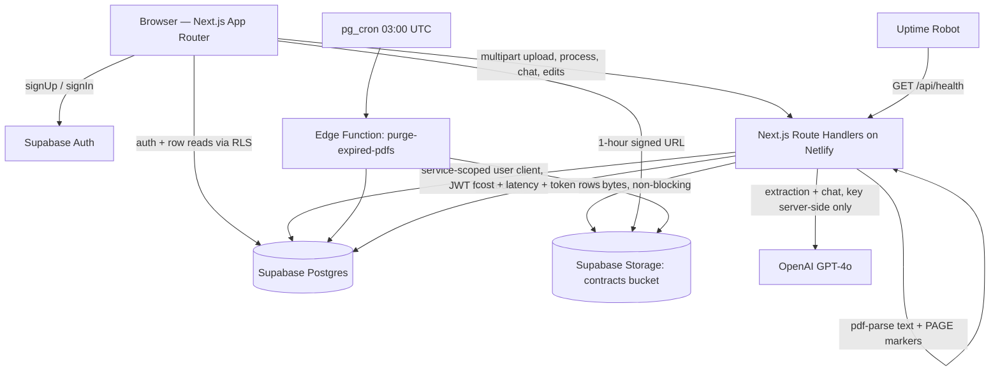
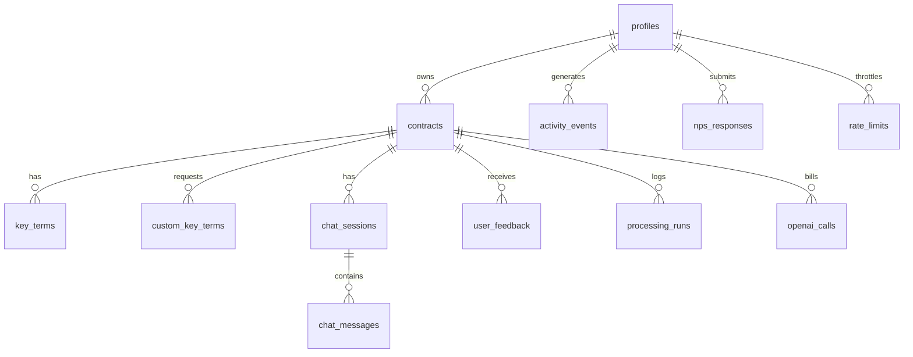

# ContractIQ — Engineering Document (High-Level Design)

**Version:** 1.0
**Status:** For approval
**Source of truth:** `docs/ContractIQ_PRD.md` (v1.0, 24 June 2026)
**Scope:** Authoritative architecture reference. No implementation begins until this document is approved.

---

## Table of Contents

1. [Executive Summary](#1-executive-summary)
2. [Product Scope](#2-product-scope)
3. [User Personas](#3-user-personas)
4. [User Flows](#4-user-flows)
5. [Frontend Architecture](#5-frontend-architecture)
6. [Backend Architecture](#6-backend-architecture)
7. [Database Design and Schema](#7-database-design-and-schema)
8. [AI Architecture](#8-ai-architecture)
9. [API Specification](#9-api-specification)
10. [Feature Breakdown](#10-feature-breakdown)
11. [Folder Structure](#11-folder-structure)
12. [Naming Conventions](#12-naming-conventions)
13. [Testing Strategy](#13-testing-strategy)
14. [Specs to Implementation Mapping](#14-specs-to-implementation-mapping)
15. [Appendix A — Resolved PRD Ambiguities](#15-appendix-a--resolved-prd-ambiguities)
16. [Appendix B — Non-Functional Requirements Traceability](#16-appendix-b--non-functional-requirements-traceability)

---

## 1. Executive Summary

### Project

**ContractIQ** — an AI-assisted NDA/MSA review tool for SMBs and freelancers without in-house legal counsel.

### Problem statement

Business professionals sign NDAs and MSAs without understanding them. A single manual review takes 90–120 minutes, requires legal expertise most SMBs lack, and costs $1,500–$3,000 when outsourced to a lawyer at $250–$500/hr. Existing tools are either enterprise CLM platforms ($50k–$500k/yr) or generic AI assistants that produce unstructured summaries with no page attribution, no confidence signal, and no contract-type-specific term schema.

### Business goal

Reduce NDA/MSA review time from 90 minutes to ≤ 15 minutes end-to-end, at a delivery cost of ≤ $0.25 per contract analysis, with ≥ 88% extraction F1 on NDAs and ≥ 85% on MSAs.

### Target users

- **Primary:** Founders / COOs / Procurement & Legal-Ops Managers at 5–250-employee companies with no in-house counsel, signing 5–15 NDAs/MSAs per month.
- **Secondary:** Freelancers and consultants receiving 1–4 MSAs per month from larger clients.

### Product differentiation the architecture must preserve (PRD §1 MOAT)

| MOAT pillar | Architectural obligation |
|---|---|
| Contract-type specificity | A versioned, server-side **term library** (`src/lib/ai/term-library.ts`) defining the 10 standard NDA terms and 12 standard MSA terms named in PRD §4 Flow 3 step 2, extensible toward the 20–30-term target without schema change. |
| Feedback-driven improvement | `key_terms.original_ai_value` preserved on every edit; `term_corrections` DB view; `profiles.feedback_opt_in` gates anonymised export for prompt improvement. |
| Confidence transparency | `confidence_score` persisted per term, always rendered, never used to hide a term. |
| Chat grounded in document | Chat context is built **only** from `contracts.contract_text`; system prompt forbids general knowledge; `[Page X]` citation is mandatory and post-validated. |

### Success criteria (engineering-owned)

| Criterion | Target | Measured by |
|---|---|---|
| North Star — upload → review complete | ≤ 15 min (baseline 90 min) | `contracts.created_at` → `contracts.review_completed_at` (set when user clicks "Mark review complete") or `MAX(activity_events.created_at)` for the contract when that flag is absent |
| Extraction accuracy | ≥ 88% F1 NDA, ≥ 85% F1 MSA (launch floor 82%) | Offline eval suite, every release |
| Confidence calibration | Predicted confidence within ±10% of observed accuracy; calibration error ≤ 0.10 | Monthly calibration curve, 10% buckets |
| Time to first extracted key-term display | ≤ 30 s P95 for ≤ 20-page contracts | `processing_runs` server-side timing rows |
| End-to-end extraction latency | ≤ 30 s P95 (≤ 45 s P95 acceptable in Measurement Beta) | `processing_runs.duration_ms` P95 `WHERE stage = 'total'` |
| Chat response latency | ≤ 15 s P95 | `chat_messages.latency_ms` P95 |
| Single OpenAI call latency | ≤ 20 s P95 | `openai_calls.latency_ms` P95 |
| Inline term edit save | ≤ 2 s | Client timing → `activity_events` |
| Export generation | ≤ 5 s | Client timing → `activity_events` |
| Auth flow | ≤ 10 s | Client timing → `activity_events` |
| Cost per analysis | ≤ $0.25 total, ≤ $0.20 extraction | `openai_calls.cost_usd` summed per contract |
| Correction rate | ≤ 12% of terms (≤ 20% in beta) | `term_corrections` view, 7-day rolling |
| Chat hallucination rate | ≤ 5% | Monthly expert review of 50 Q&A pairs |
| Critical failures (cross-user data exposure) | 0% | RLS test suite in CI + pre-launch penetration review |
| Uptime | 99.5% | Uptime Robot |
| Accessibility | WCAG 2.1 AA | axe-core CI gate + manual audit in v1.0 |
| 30-day retention / NPS / contracts per user | ≥ 45% / ≥ 40 / ≥ 4 | `activity_events` + `nps_responses` + dashboard analytics queries |

---

## 2. Product Scope

### 2.1 In scope (MVP, v0.1 → v1.0)

| # | Item | PRD ref |
|---|---|---|
| 1 | Email/password authentication, session management, sign-out | FR-01, US-001 |
| 2 | Contract-type selection (NDA \| MSA) and PDF upload (≤ 10 MB, ≤ 20 pages, ≤ 15,000 tokens) | FR-02, §5 |
| 3 | Server-side text extraction at upload with `[PAGE N]` markers, persisted to `contracts.contract_text` | FR-03, §3 Component B architecture note |
| 4 | Pre-processing preview of the standard term list for the selected type | §4 Flow 3 step 2 |
| 5 | Up to 5 custom key terms added before processing | FR-05, US-005, §5 |
| 6 | GPT-4o key-term extraction returning `{term_name, value, page_number, confidence_score, source_sentence}` | FR-04, §8 |
| 7 | Key terms panel: name, value, 1-indexed page, colour-coded confidence, ⚠️ + tooltip below 50% | FR-04, FR-11, US-004 |
| 8 | Expandable "Why?" source-sentence section per term | §4 Flow 3 step 9, §7 |
| 9 | Inline PDF viewer (PDF.js, 1-hour signed URL) **with paginated text-viewer fallback** | FR-06, US-006 |
| 10 | Click-to-navigate from a term's page reference to that page, with highlight | FR-07, US-003 |
| 11 | Inline key term editing with "Edited" badge and preserved original AI value | FR-04/US-009 |
| 12 | Contract chat grounded in full contract text, mandatory `[Page X]` citation, persistent history | FR-08, FR-09, US-007, US-012 |
| 13 | Dashboard: totals, NDA/MSA breakdown, last 5 contracts, sortable full history, clickable rows | FR-10, US-008 |
| 14 | Thumbs up/down + optional comment feedback per review | FR-12, US-010 |
| 15 | Single Supabase project with RLS on every table + Storage RLS, expressible as one paste-and-run SQL file | FR-13, FR-14 |
| 16 | Manual contract deletion (contract + all associated data + stored PDF) | §5 retention |
| 17 | 90-day post-last-access auto-deletion of stored PDFs | §5 retention |
| 18 | Rate limiting, cost controls, retry/backoff, human-readable error states | §5, §11 |
| 19 | Not-legal-advice disclaimer on every results page; "Powered by OpenAI GPT-4o" footer | §9, §11 |
| 20 | Landing page (static: value prop, demo GIF, "Sign In" + "Get Started Free") | §4 Flow 1 |

### 2.2 Out of scope (MVP)

| Item | Reason / PRD ref |
|---|---|
| Scanned / image-only PDFs, OCR | §5; OCR deferred to v1.2 |
| Non-English contracts; non-US/UK governing law | §5, Assumption 2 |
| Contract types other than NDA and MSA | PRD header, §5 |
| Contracts > 20 pages / > 15,000 tokens | §5, Assumption 5 |
| Chunked / vector RAG retrieval | §7 — deferred until length limits rise |
| Fine-tuned extraction model | §3 Component C — v2 |
| Multi-user / team workspaces, seats, API access | v1.2 / Pro tier (§12) |
| Native desktop app | Assumption 10 |
| Batch upload, contract comparison, email notifications | v1.1 / v1.2 |
| Payment collection and subscription billing | **Not specified in the PRD** — see Appendix A, A-06. MVP ships with plan/quota *enforcement* but no payment provider integration. |

### 2.3 Future enhancements (post-v1.0)

| Release | Items | PRD ref |
|---|---|---|
| v1.1 | CSV export, PDF summary export, batch upload (≤ 5 contracts), dashboard analytics charts (contracts by month, correction rate) | §3 Roadmap, US-011 |
| v1.2 | OCR for scanned PDFs (AWS Textract or equivalent), side-by-side contract comparison, email notification on completion, multi-user team workspace | §3 Roadmap |
| v2 | Fine-tuned extraction model; chunked RAG for long contracts; non-US few-shot examples for jurisdiction fairness | §3, §7, §11 Fairness |

---

## 3. User Personas

| Persona | Role & context | Permissions | Primary workflows |
|---|---|---|---|
| **Authenticated User (Founder / Ops Lead)** — primary | 5–250-employee company, no in-house counsel; 5–15 contracts/month; industries: SaaS, agency, professional services, fintech, e-commerce | Full CRUD on **own** rows only (`auth.uid() = user_id`), enforced by RLS on every table and Storage object. May upload, process, edit terms, chat, export, delete, submit feedback. | Upload → extract → review terms → verify via PDF → correct → chat → mark complete |
| **Authenticated User (Freelancer / Consultant)** — secondary | Individual contributor; 1–4 client MSAs/month; design, marketing, software, consulting | Identical to primary; differentiated only by plan tier quota. | Upload → review liability/payment/IP terms → chat → export |
| **Anonymous Visitor** | Prospect on the marketing page | Read-only access to the static landing page and legal pages. No database read path exists (RLS denies all anon access). | View value prop → "Get Started Free" → sign up |
| **Operator / Engineer** (internal, not an in-app role) | Team member running evals, monitoring, and prompt reviews | Access via Supabase dashboard and `service_role` key held only in server-side environment variables. Never granted to a browser. | Run eval suite, review `term_corrections`, rotate prompt version, respond to incidents |
| **Legal SME** (internal, not an in-app role) | Annotates ground truth; monthly QA audit of 5 random contracts | Offline access to the eval dataset repository only; **no production data access** beyond the audit sample exported by an Operator. | Annotate 30 NDA + 20 MSA; monthly audit |

There are **no in-app admin or multi-tenant roles at MVP.** Every authenticated user is a single-tenant owner of their own data. Team workspaces (v1.2) will introduce the first role split and are explicitly deferred.

---

## 4. User Flows

Format: `User Action → Frontend Behavior → Backend Processing → Database Interaction → System Response`

### 4.1 Flow 1 — New visitor → Sign up → Dashboard (US-001, FR-01)

```
Land on "/"
  → Frontend: static marketing page (Server Component, no data fetch): value prop,
    demo GIF, CTAs "Sign In" and "Get Started Free"
  → Backend: none (statically rendered, cached at CDN)
  → DB: none
  → System: page renders < 1s (no auth round-trip)

Click "Get Started Free" → "/signup"
  → Frontend: sign-up form (email + password); client-side zod validation
    (valid email; password ≥ 8 chars with ≥ 1 letter and ≥ 1 digit); submit disabled
    until valid; button enters loading state
  → Backend: supabase.auth.signUp({ email, password }) from the browser client
    (Supabase Auth is called directly; no custom API route)
  → DB: Supabase writes auth.users; the on_auth_user_created trigger inserts
    a matching row into public.profiles (id, email, plan='free_trial',
    trial_ends_at = now() + 14 days, feedback_opt_in = false)
  → System: if "Confirm email" is ON, show "Check your inbox to verify your email";
    on verification-link click Supabase redirects to /auth/callback which exchanges
    the code for a session and routes to /dashboard. If "Confirm email" is OFF
    (default for MVP — see Appendix A, A-05), a session is returned immediately and
    the user is routed straight to /dashboard. Whole flow completes ≤ 10s (US-001).
    Invalid credentials / duplicate email → inline, human-readable error
    ("That email is already registered — try signing in instead").

Arrive at /dashboard with zero contracts
  → Frontend: dashboard shell renders empty state
  → Backend: Server Component reads session from cookies
  → DB: SELECT ... FROM contracts WHERE user_id = auth.uid() → 0 rows
  → System: empty state — "No contracts reviewed yet — upload your first contract
    to begin" + primary CTA "Review a Contract"
```

### 4.2 Flow 2 — Returning user → Dashboard (FR-10, US-008)

```
Click "Sign In" → submit credentials
  → Frontend: /login form, loading state, zod validation
  → Backend: supabase.auth.signInWithPassword; session cookie set via
    @supabase/ssr; middleware refreshes the token on every request
  → DB: auth.users lookup
  → System: redirect to /dashboard (≤ 10s); invalid credentials →
    "Email or password is incorrect."

/dashboard renders
  → Frontend: summary card + recent list + sortable history table
  → Backend: Server Component with the user-scoped Supabase client
  → DB: (a) SELECT count(*) , count(*) FILTER (WHERE contract_type='NDA'),
        count(*) FILTER (WHERE contract_type='MSA') FROM contracts
        WHERE user_id = auth.uid();
        (b) SELECT id, file_name, contract_type, status, created_at
        FROM contracts WHERE user_id = auth.uid()
        ORDER BY created_at DESC LIMIT 5;
        (c) paginated full list (50/page) sortable by created_at | file_name |
        contract_type, served by idx_contracts_user_created
  → System: summary card (total processed, NDA/MSA breakdown), last 5 contracts
    with status badge + date, prominent "Review a Contract" quick action, and a
    sortable/clickable full history table. Clicking any row → /contracts/{id}.
    A contract with status='error' shows a "Retry" action that re-runs processing
    without re-uploading the file.
```

### 4.3 Flow 3 — Core contract review (US-002 → US-005, US-009, FR-02 → FR-07, FR-11)

```
Click "Review a Contract" → /contracts/new
  → Frontend: step 1 — contract type dropdown (NDA | MSA), required, no default
  → Backend/DB: none yet
  → System: file dropzone unlocks only after a type is chosen

Select or drag-drop a PDF
  → Frontend: client pre-checks — MIME application/pdf, size ≤ 10 MB;
    reads the page count with pdf.js getDocument().numPages and rejects > 20 pages
    before any byte leaves the browser. On low-end/mobile devices an advisory
    banner appears ("For files near 10 MB we recommend desktop Chrome or Firefox").
    Failures render inline, e.g. "This file is 14.2 MB — the limit is 10 MB."
  → Backend: POST /api/contracts/upload (multipart) — the *authoritative* gate.
    Server re-validates: auth session present; plan quota not exceeded;
    magic-bytes %PDF- check; size ≤ 10 MB; pages ≤ 20 via pdf-parse numpages;
    then pdf-parse extracts text page-by-page, joining pages as
    "[PAGE 1]\n...\n[PAGE 2]\n..." ; token count estimated
    (tiktoken o200k_base) and rejected above 15,000 tokens; text < 100 words
    → 422 SCANNED_PDF. Storage upload to
    contracts/{user_id}/{contract_id}/{filename}.pdf is attempted **after** the DB
    insert and is non-blocking — on failure file_path stays NULL and the request
    still succeeds.
  → DB: INSERT INTO contracts (id, user_id, file_name, contract_type, page_count,
    token_estimate, contract_text, file_path, status='uploaded',
    last_accessed_at=now()); then UPDATE contracts SET file_path=... if Storage
    succeeded.
  → System: 201 { contract_id, page_count, token_estimate, storage_available }
    → client routes to /contracts/{id}/prepare

Pre-processing preview
  → Frontend: preview card lists the standard terms for the chosen type, read from
    the shared term library:
      NDA (10): Parties, Effective Date, Confidentiality Obligations,
      Permitted Disclosures, Term & Duration, Governing Law, Jurisdiction,
      IP Ownership, Non-Solicitation, Breach & Remedy
      MSA (12): Parties, Service Scope, Payment Terms, Invoice Schedule,
      Late Payment Penalty, Liability Cap, Indemnification, IP Ownership,
      Termination Clause, Governing Law, Dispute Resolution, Notice Period
    If storage_available is false, an inline note says the PDF viewer is
    unavailable and the text viewer will be used instead.
  → Backend/DB: none (term library is static, versioned code)
  → System: "+ Add Key Term" button visible

Add custom terms (optional, ≤ 5)
  → Frontend: text input, 3–60 chars, deduplicated case-insensitively against the
    standard list and each other; each added term shows a "Custom" badge and a
    remove control; the button disables at 5 with the helper text
    "5 custom terms is the limit for now."
  → Backend: POST /api/contracts/{id}/custom-terms (server re-enforces the cap of 5)
  → DB: INSERT INTO custom_key_terms (contract_id, user_id, term_name,
    is_manual=true)
  → System: preview list updates optimistically; server response reconciles

Click "Process Contract"
  → Frontend: 3-step progress indicator — (1) Extracting text ✓ (already done at
    upload, shown complete immediately), (2) Analysing with AI, (3) Compiling
    results. A non-blocking elapsed timer and a cancel-free "this usually takes
    under 30 seconds" note are shown.
  → Backend: POST /api/contracts/{id}/process
      1. rate-limit check (per user: 10 processes / hour; global concurrency
         semaphore of 100 in-flight analyses)
      2. load contracts.contract_text (never re-downloads the PDF)
      3. build extraction prompt: few-shot (3 NDA + 3 MSA examples) + standard
         term list for the type + custom term names appended
      4. call GPT-4o — JSON mode, temperature 0.1, max_tokens 2000, user=<user_id>,
         20s timeout, 3 attempts with exponential backoff (1s/2s/4s + jitter);
         one extra automatic JSON-repair retry if parsing fails
      5. validate each item with zod: term_name non-empty; page_number integer
         within 1..page_count; confidence 0.0–1.0 → stored as 0–100 integer;
         source_sentence non-empty **and** verified to occur in contract_text
         (normalised whitespace/quotes); a term failing source verification is
         persisted with is_source_verified=false and confidence capped at 49 so
         it renders with the low-confidence warning
      6. contract-type sanity check: if the model's detected_type disagrees with
         the user's selection, set contracts.type_mismatch_warning = true
      7. record token usage and cost in openai_calls; record stage timings in
         processing_runs
  → DB: transactional INSERT of all rows into key_terms (with is_custom flag);
    UPDATE contracts SET status='completed', processed_at=now(),
    first_term_ready_ms=..., detected_type=...
    On unrecoverable failure: UPDATE contracts SET status='error',
    error_code=..., error_message=... and **no partial key_terms rows are kept**
    (the insert is a single transaction).
  → System: redirect to /contracts/{id}. On error the user sees a human-readable
    message and a "Try again in a few minutes" CTA that re-invokes /process
    without re-uploading.

Results page /contracts/{id}
  → Frontend: two-panel layout.
      Left  — PDF.js viewer (scroll, zoom ±, lazy per-page rendering, page numbers,
              highlighted spans for extracted source sentences). If the signed URL
              is missing or PDF.js throws, it degrades to (a) the paginated text
              viewer built from [PAGE N] markers, and (b) a "Download PDF" link
              when a file_path exists.
      Right — key terms list: Term Name | Extracted Value | Page N | Confidence %,
              colour-coded green ≥ 80, amber 50–79, red < 50; ⚠️ + non-dismissible
              tooltip "Low confidence — we recommend verifying this in the
              document directly." for < 50; terms are never hidden. The 10–12 most
              material terms (term library display_rank ≤ 12) are expanded by
              default; the remainder sit under a "Show all terms" disclosure.
              Each row has an expandable "Why?" showing the verbatim
              source_sentence. A permanent disclaimer banner reads: "This is an
              AI-assisted review tool, not legal advice. Always verify critical
              terms with a qualified lawyer."
  → Backend: Server Component fetch + POST /api/contracts/{id}/signed-url (1-hour
    expiry) ; GET touches update contracts.last_accessed_at
  → DB: SELECT contract + key_terms ORDER BY display_rank, term_name
  → System: clicking a page reference sets targetPage; **both** viewers accept the
    same targetPage prop, smooth-scroll to that page and flash a highlight on the
    referenced span. Opening a low-confidence term auto-highlights the nearest
    matching span on its page.

Inline correction
  → Frontend: click value → inline input → save (Enter) / cancel (Esc); optimistic
    update with rollback on failure
  → Backend: PATCH /api/key-terms/{id} (ownership re-checked server-side)
  → DB: UPDATE key_terms SET value=$1, is_edited=true, edited_at=now()
    — original_ai_value was populated at insert and is never overwritten
  → System: "Edited" badge appears; save completes ≤ 2s; the row now surfaces in
    the term_corrections view that drives the ≤ 12% correction-rate alert.

Mark review complete / submit feedback
  → Frontend: "Mark review complete" button; thumbs-up/down + optional comment
  → Backend: POST /api/contracts/{id}/complete ; POST /api/feedback
  → DB: UPDATE contracts SET review_completed_at=now(); INSERT INTO user_feedback
  → System: North Star timer closes; confirmation toast; NPS survey shown once per
    user per 30 days at session end.
```

### 4.4 Flow 4 — Chat with contract (US-007, US-012, FR-08, FR-09)

```
Click the floating "Chat with Contract" button (or the Chat sidebar tab)
  → Frontend: chat panel opens **inside the results view** (the PDF/terms panels
    stay mounted); prior history loads immediately
  → Backend: GET /api/contracts/{id}/chat
  → DB: SELECT or lazily INSERT chat_sessions for (contract_id, user_id);
    SELECT * FROM chat_messages WHERE session_id=$1 ORDER BY created_at ASC
    LIMIT 200
  → System: previous conversation renders (user right-aligned, assistant
    left-aligned); empty state suggests starter questions such as "What happens if
    I breach this NDA?" and "Is there an auto-renewal clause?"

Type a question → send
  → Frontend: optimistic user bubble + typing indicator; input disabled until the
    answer returns; 15s soft-timeout copy ("still reading your contract…")
  → Backend: POST /api/contracts/{id}/chat
      1. rate-limit (30 messages / hour / user)
      2. classify the query locally as contract | history | both using a
         deterministic keyword/heuristic classifier — **no extra API call**
      3. assemble messages[]: system prompt (document-only, mandatory [Page X]
         citation, "Based on the document…" prefix, "I cannot find this in the
         document" fallback) + full contracts.contract_text as context when the
         class is contract|both + the full prior conversation (up to 200 messages,
         ascending) always
      4. GPT-4o, temperature 0.4, max_tokens 1000, user=<user_id>, 20s timeout,
         3 retries with backoff
      5. post-validate: if the reply asserts content but carries no [Page X] tag,
         one repair retry is issued asking for the citation; if it still lacks one,
         the response is shown with an "unverified citation" notice
  → DB: INSERT INTO chat_messages (session_id, user_id, role='user', content);
    INSERT INTO chat_messages (..., role='assistant', content, cited_pages,
    latency_ms, token_usage); UPDATE chat_sessions.last_message_at
  → System: answer renders ≤ 15s P95 with a clickable "Source: Page X" chip that
    drives the same targetPage navigation used by the key-terms panel. History
    persists across refresh and across sessions (US-012).
```

### 4.5 Flow 5 — Deletion and retention (PRD §5, §11)

```
Click "Delete" on a contract (dashboard row menu or results page)
  → Frontend: confirmation modal naming exactly what is removed — the PDF, the
    extracted text, all key terms, chat history and feedback
  → Backend: DELETE /api/contracts/{id} — ownership verified, Storage object
    removed, then the DB row deleted
  → DB: DELETE FROM contracts WHERE id=$1 AND user_id=auth.uid();
    ON DELETE CASCADE removes key_terms, custom_key_terms, chat_sessions,
    chat_messages, user_feedback, processing_runs, openai_calls
  → System: row disappears; toast "Contract and all associated data deleted."

Nightly retention job (Supabase pg_cron, 03:00 UTC)
  → DB: select contracts where last_accessed_at < now() - interval '90 days'
    and file_path is not null
  → Backend: Edge Function purge-expired-pdfs deletes each Storage object, then
    sets file_path=NULL, pdf_purged_at=now()
  → System: the contract record, its extracted text and its key terms remain
    (they are the review record); the results page automatically serves the text
    viewer and shows "The original PDF was removed after 90 days of inactivity."

Account deletion request (GDPR)
  → Frontend: Settings → "Delete my account and all data"
  → Backend: DELETE /api/account — purges all Storage objects under
    contracts/{user_id}/, deletes the profile row (cascading all user data), then
    deletes the auth user via the service-role admin client
  → DB: cascade delete across every table keyed on user_id
  → System: user signed out; confirmation email; completed within the request, no
    manual ops step required.
```

---

## 5. Frontend Architecture

### 5.1 Stack

| Concern | Choice | Rationale |
|---|---|---|
| Framework | **Next.js 14 (App Router), TypeScript strict** | Fixed by project convention. Server Components remove a client round-trip for dashboard/results reads; Route Handlers provide the "thin backend" the PRD asks for, co-deployed with the frontend. (See Appendix A, A-01: the PRD said "React SPA"; Next.js supersedes it and satisfies every stated requirement.) |
| Styling | **Tailwind CSS** + design tokens from `docs/design.md` | PRD §6 names Tailwind. |
| UI primitives | shadcn/ui (Radix underneath) | Radix gives accessible dialogs, tooltips, dropdowns and focus management — a direct lever on the WCAG 2.1 AA requirement. |
| Server state | **TanStack Query v5** | Cache, retry and optimistic updates for term edits and chat. |
| Client state | React Context + `useReducer` for the upload wizard and the viewer's `targetPage`; Zustand only if a third consumer appears | Keeps state minimal; the PRD flags client-side state management as the React trade-off. |
| Forms & validation | react-hook-form + **zod** (schemas shared with the API layer) | One schema per contract, used on both sides — validation cannot drift. |
| PDF rendering | **pdfjs-dist** (PDF.js) with a lazy, virtualised page list | PRD §6; lazy loading is the stated mitigation for large-file memory pressure. |
| Auth client | `@supabase/ssr` browser + server clients; Next.js middleware refreshes sessions | Cookie-based sessions readable by Server Components and Route Handlers. |
| Charts (v1.1) | Recharts | Dashboard analytics only. |
| Testing | Vitest + React Testing Library; Playwright for E2E; axe-core for a11y | §13. |

### 5.2 Routing strategy

| Route | Rendering | Auth | Purpose |
|---|---|---|---|
| `/` | Static (Server Component) | Public | Landing: value prop, demo GIF, "Sign In" / "Get Started Free" |
| `/login`, `/signup` | Client Components | Public (redirect to `/dashboard` if a session exists) | Auth forms |
| `/auth/callback` | Route Handler | Public | Exchanges an email-verification / OAuth code for a session |
| `/dashboard` | Server Component + client table island | Protected | Summary card, last 5, sortable history |
| `/contracts/new` | Client Component | Protected | Type selector + upload dropzone |
| `/contracts/[id]/prepare` | Server shell + client island | Protected | Term preview, custom terms, "Process Contract" |
| `/contracts/[id]` | Server Component shell + client panels | Protected | Two-panel results + chat |
| `/settings` | Server + client | Protected | Plan/quota, feedback opt-in, account deletion |
| `/legal/terms`, `/legal/privacy` | Static | Public | ToS (incl. the third-party-confidential-contract prohibition) and privacy/DPA notice |
| `/trust` (v1.1) | Static | Public | Published F1 and calibration benchmarks |

Protection is enforced in two layers: `middleware.ts` redirects unauthenticated requests for `/dashboard`, `/contracts/*` and `/settings` to `/login?next=…`, and every Route Handler independently re-checks the session. **Neither layer is trusted alone; RLS is the third and final gate.**

### 5.3 Component hierarchy

```
app/
├─ (marketing)/page.tsx ............... Hero, DemoGif, FeatureGrid, Footer(PoweredByOpenAI)
├─ (auth)/login|signup ................ AuthCard → AuthForm → FieldError
├─ (app)/dashboard/page.tsx
│   ├─ SummaryCard ................... total • NDA/MSA breakdown • this-month count
│   ├─ RecentContractsList ........... last 5, status badge + date
│   ├─ ContractsTable ................ sortable (date|name|type), paginated, row → results
│   └─ EmptyState .................... "No contracts reviewed yet…" + CTA
├─ (app)/contracts/new/page.tsx
│   ├─ ContractTypeSelect ............ NDA | MSA
│   ├─ PdfDropzone ................... drag-drop + picker, client pre-validation
│   └─ UploadProgress ................ percentage + cancel
├─ (app)/contracts/[id]/prepare/page.tsx
│   ├─ TermPreviewList ............... standard terms for the type
│   ├─ CustomTermInput ............... "+ Add Key Term", max 5, Custom badge
│   └─ ProcessButton + ProcessingSteps  3-step indicator
└─ (app)/contracts/[id]/page.tsx
    ├─ DisclaimerBanner .............. "not legal advice" (always rendered)
    ├─ TypeMismatchNotice ............ soft warning when detected ≠ selected
    ├─ CalibrationNotice ............. shown when the ops flag records ≥15% miscalibration
    ├─ DocumentPanel (left)
    │   ├─ PdfViewer ................. PDF.js, lazy pages, zoom, highlight spans
    │   ├─ TextViewer ................ [PAGE N] fallback, identical targetPage API
    │   └─ DownloadPdfLink ........... shown when rendering fails but a file exists
    ├─ KeyTermsPanel (right)
    │   ├─ KeyTermRow ................ name | value | PageChip | ConfidenceBadge
    │   │   ├─ ConfidenceBadge ....... green ≥80 / amber 50–79 / red <50 + ⚠️ tooltip
    │   │   ├─ WhySection ............ expandable verbatim source_sentence
    │   │   └─ InlineTermEditor ...... edit → save ≤2s → "Edited" badge
    │   └─ ShowAllTermsDisclosure .... top 10–12 expanded, rest collapsed
    ├─ ChatPanel ..................... floating button / sidebar tab, same view
    │   ├─ MessageList ............... user right-aligned, assistant left-aligned
    │   ├─ PageCitationChip .......... "Source: Page X" → targetPage
    │   └─ ChatComposer .............. disabled while awaiting a reply
    ├─ FeedbackWidget ................ 👍/👎 + optional comment
    └─ CompleteReviewButton .......... closes the North Star timer
```

### 5.4 UX states

| State | Treatment |
|---|---|
| **Loading** | Skeletons for dashboard cards, terms panel and PDF pages. The processing screen shows the literal 3 steps from the PRD. No spinner without accompanying text. |
| **Empty** | Dashboard: "No contracts reviewed yet — upload your first contract to begin". Chat: starter-question suggestions. Terms panel: never empty after a successful run — a term the model could not find is stored with `value = null` and rendered as "Not found in document" with a 0% confidence badge, so the user learns what was searched for. |
| **Error** | Every error maps to a human-readable message and a next action. Upload: oversize, > 20 pages, > 15,000 tokens, non-PDF, scanned PDF, quota exceeded. Processing: OpenAI unavailable → "We couldn't reach the AI service. Try again in a few minutes." + Retry (contract stays `status='error'`, no re-upload needed). Chat: same treatment, the question stays in the composer. Supabase outage → global maintenance banner. Storage outage → viewer hidden, everything else works. |
| **Partial / degraded** | `storage_available = false` → text viewer with an explanatory note. PDF.js render failure → text viewer + Download link. Missing citation in a chat reply → "unverified citation" notice. |
| **Responsive** | Desktop-first two-panel layout (≥ 1024 px). Tablet: tabbed Document / Terms / Chat. Mobile: single-column stack, chat as a bottom sheet, plus an advisory that large PDFs are best reviewed on desktop Chrome or Firefox. |
| **Accessibility (WCAG 2.1 AA)** | Confidence is conveyed by **icon + text + colour**, never colour alone. All contrast ≥ 4.5:1 (verified against `docs/design.md` tokens). Full keyboard operation of dropzone, term editing, page chips and chat. Focus is trapped in modals and returned on close. Live regions announce processing-step changes and new chat messages. Every control has an accessible name; the PDF viewer exposes the text-viewer fallback as a first-class alternative for screen-reader users. Every piece of legal jargon in the terms panel carries a plain-English tooltip (also reachable on focus, not hover-only). axe-core runs in CI and fails the build on any serious/critical violation. |

---

## 6. Backend Architecture

### 6.1 Stack and deployment topology

| Layer | Technology | Deployment |
|---|---|---|
| API layer | **Next.js Route Handlers** (Node.js runtime, TypeScript) under `app/api/*` | Netlify Functions, via `@netlify/plugin-nextjs` |
| Scheduled jobs | **Supabase Edge Functions** + `pg_cron` | Supabase |
| Auth | Supabase Auth (email/password, JWT in HTTP-only cookies) | Supabase |
| Database | Supabase PostgreSQL 15 + RLS | Supabase (Pro before beta) |
| Object storage | Supabase Storage, private `contracts` bucket, 1-hour signed URLs | Supabase |
| LLM | OpenAI GPT-4o, server-side only | OpenAI |
| PDF text extraction | `pdf-parse` (Node) | Inside the upload Route Handler |

The PRD offers "Supabase Edge Functions **or** a hosted Node.js API". We use **Next.js Route Handlers on Netlify for all request/response APIs** (they run in the Node runtime, so `pdf-parse` works, they share zod schemas and types with the frontend, and they avoid the ~300 ms Deno cold start on the user's critical path) and **Supabase Edge Functions only for scheduled/background jobs** that have no latency budget. See Appendix A, A-02.



### 6.2 Core systems

**Authentication.** Supabase Auth with email/password. Sessions are JWTs in HTTP-only, `Secure`, `SameSite=Lax` cookies managed by `@supabase/ssr`; `middleware.ts` refreshes them on each request. Sign-out clears the session both client- and server-side. The browser only ever holds the anon/publishable key; the `service_role` key exists solely in server environment variables and is used exclusively by the account-deletion path and scheduled jobs.

**Authorisation.** Three independent layers, each sufficient on its own to prevent cross-user access:
1. Middleware route protection (UX-level).
2. Per-handler session check plus an explicit `user_id` ownership predicate on every query.
3. **PostgreSQL RLS** on every table — the authoritative control. Each Route Handler creates a Supabase client bound to the caller's JWT, so RLS applies to server-side queries too. Storage RLS restricts INSERT/SELECT/DELETE on `storage.objects` to `auth.uid()::text = (storage.foldername(name))[1]`.
Assumption 9 of the PRD (RLS isolates users without custom middleware) is therefore treated as *unproven until tested*: the CI suite includes cross-user access attempts from two real test accounts for every table and for Storage.

**Business logic / orchestration.** The API layer stays thin. Domain logic lives in `src/lib/`:
- `services/contract-service.ts` — upload validation, text extraction, persistence, deletion
- `services/extraction-service.ts` — prompt assembly, OpenAI call, parse, validate, persist
- `services/chat-service.ts` — query classification, context assembly, call, citation validation, persistence
- `ai/openai-client.ts` — a single wrapper owning timeouts, retries, token accounting, cost accounting and the `user` parameter

**Validation.** One zod schema per payload in `src/lib/validation/`, imported by both the client form and the Route Handler. Requests failing validation return `400` with a field-level error map. Model output is validated by `keyTermSchema` before anything is written; invalid items are dropped and counted rather than persisted.

**Middleware / cross-cutting.**
- *Rate limiting* — Postgres-backed fixed-window counters in `rate_limits` (no extra infrastructure): upload 20/hr, process 10/hr, chat 30/hr per user; exceeding returns `429` with `Retry-After`.
- *Concurrency guard* — an advisory-lock-based semaphore caps in-flight analyses at 100; beyond that, requests queue with a "high demand" message rather than degrading (PRD §5 scalability).
- *Quota* — plan limits (`free_trial` 5 total in 14 days, `starter` 10/mo, `growth` 40/mo, `pro` unlimited) checked on upload against `contracts` counts.
- *Security headers* — CSP, HSTS, `X-Content-Type-Options`, `Referrer-Policy` set in `next.config.js`.
- *Request logging* — structured JSON (request id, user id, route, duration, outcome). Contract text and chat content are **never** logged.

**Error handling.** A single `AppError` type carries `{ code, httpStatus, userMessage, retryable }`. Codes surfaced to users: `FILE_TOO_LARGE`, `TOO_MANY_PAGES`, `TOO_MANY_TOKENS`, `NOT_A_PDF`, `SCANNED_PDF`, `CORRUPT_PDF`, `QUOTA_EXCEEDED`, `RATE_LIMITED`, `AI_UNAVAILABLE`, `AI_TIMEOUT`, `AI_INVALID_OUTPUT`, `STORAGE_UNAVAILABLE` (non-blocking, informational only), `NOT_FOUND`, `FORBIDDEN`. There are no silent failures: every failure either renders a message with a next action or, for Storage, degrades to the text viewer with an explanation. A corrupt PDF produces a graceful error with **no partial output stored**.

**Resilience.** OpenAI: 20 s timeout, 3 attempts, exponential backoff with jitter, plus one JSON-repair retry that is not counted against the 3. On exhaustion, `contracts.status='error'` is persisted so the user can retry without re-uploading. Storage: a failed upload never fails the request. Supabase: all multi-row writes are single transactions, so an outage cannot leave partial extraction results.

**Observability.** `GET /api/health` (checks DB reachability and returns build SHA) is polled by Uptime Robot with alerts to the team Slack channel. Netlify function logs, the Supabase dashboard and the OpenAI usage dashboard complete the picture. In-DB telemetry — `processing_runs` (stage timings), `openai_calls` (tokens, cost, latency, outcome), `activity_events` (product analytics) — powers the latency, cost and retention metrics without a third-party analytics vendor. A daily cost rollup alerts at **80% of the monthly OpenAI budget**; a weekly storage check alerts at **70% of the Supabase storage allowance**.

**Incident response.** P0 (data exposure or full outage): in-app banner plus email to affected users within 1 hour; public status page updated within 30 minutes. P1 (degraded performance): in-app banner within 2 hours. The banner is driven by a `system_status` row readable by all authenticated users, so it can be raised without a deploy.

---

## 7. Database Design and Schema

Single Supabase Postgres project. **Every table carries `user_id` and has RLS enabled with owner-only policies.** All timestamps are `timestamptz`. All primary keys are `uuid` defaulting to `gen_random_uuid()`. The complete schema — tables, indexes, triggers, views, RLS policies, the `contracts` Storage bucket (`INSERT INTO storage.buckets`) and three `CREATE POLICY ON storage.objects` statements (INSERT/SELECT/DELETE) — is expressible as a **single paste-and-run SQL file** (FR-14); that file is produced in the implementation-spec stage, not here.



### 7.1 `profiles`

**Purpose:** application-level user record mirroring `auth.users`; holds plan, quota window, and the feedback opt-in that gates anonymised corpus use.

| Column | Type | Notes |
|---|---|---|
| `id` | `uuid` PK | FK → `auth.users(id)` ON DELETE CASCADE |
| `email` | `text NOT NULL` | Copied from auth on insert |
| `plan` | `text NOT NULL DEFAULT 'free_trial'` | CHECK IN ('free_trial','starter','growth','pro') |
| `trial_ends_at` | `timestamptz` | `now() + 14 days` at signup |
| `feedback_opt_in` | `boolean NOT NULL DEFAULT false` | Gates anonymised export of corrections for prompt improvement |
| `created_at` / `updated_at` | `timestamptz NOT NULL DEFAULT now()` | `updated_at` maintained by trigger |

**Relationships:** 1→N `contracts`. **Constraints:** one profile per auth user (PK). **Indexes:** PK only. **Trigger:** `on_auth_user_created` (AFTER INSERT ON `auth.users`) inserts the profile. **RLS:** `SELECT/UPDATE USING (id = auth.uid())`; no client INSERT or DELETE (insert via trigger, delete via cascade).

### 7.2 `contracts`

**Purpose:** one row per uploaded contract; holds the extracted text that is the single source of truth for every AI call.

| Column | Type | Notes |
|---|---|---|
| `id` | `uuid` PK | |
| `user_id` | `uuid NOT NULL` | FK → `profiles(id)` ON DELETE CASCADE |
| `file_name` | `text NOT NULL` | Original filename, sanitised |
| `contract_type` | `text NOT NULL` | CHECK IN ('NDA','MSA') — user's selection |
| `detected_type` | `text` | CHECK IN ('NDA','MSA','OTHER') — model's read |
| `type_mismatch_warning` | `boolean NOT NULL DEFAULT false` | Drives the soft warning banner |
| `file_path` | `text` | `contracts/{user_id}/{contract_id}/{filename}.pdf`; **NULL is valid** (Storage failure or 90-day purge) |
| `file_size_bytes` | `integer NOT NULL` | CHECK ≤ 10485760 |
| `page_count` | `integer NOT NULL` | CHECK BETWEEN 1 AND 20 |
| `token_estimate` | `integer NOT NULL` | CHECK ≤ 15000 |
| `contract_text` | `text NOT NULL` | Full text with `[PAGE N]` markers; encrypted at rest by Supabase |
| `status` | `text NOT NULL DEFAULT 'uploaded'` | CHECK IN ('uploaded','processing','completed','error') |
| `error_code` / `error_message` | `text` | Populated only when `status='error'` |
| `first_term_ready_ms` | `integer` | Time-to-first-term metric |
| `processed_at` | `timestamptz` | Extraction completion |
| `review_completed_at` | `timestamptz` | North Star end timestamp |
| `last_accessed_at` | `timestamptz NOT NULL DEFAULT now()` | Touched on every results-page view; drives 90-day retention |
| `pdf_purged_at` | `timestamptz` | Set by the retention job |
| `prompt_version` | `text NOT NULL DEFAULT 'v1.0'` | Which prompt library version produced the terms |
| `created_at` / `updated_at` | `timestamptz NOT NULL DEFAULT now()` | |

**Indexes:** `idx_contracts_user_created (user_id, created_at DESC)` — dashboard list and sort; `idx_contracts_user_type (user_id, contract_type)` — NDA/MSA breakdown; `idx_contracts_user_name (user_id, file_name)` — name sort; `idx_contracts_retention (last_accessed_at) WHERE file_path IS NOT NULL` — nightly purge scan; `idx_contracts_status (user_id, status)` — retry/error listing.
**RLS:** all four verbs `USING (user_id = auth.uid())` with `WITH CHECK (user_id = auth.uid())` on INSERT/UPDATE.

### 7.3 `key_terms`

**Purpose:** one row per extracted term (standard or custom), with grounding and confidence.

| Column | Type | Notes |
|---|---|---|
| `id` | `uuid` PK | |
| `contract_id` | `uuid NOT NULL` | FK → `contracts(id)` ON DELETE CASCADE |
| `user_id` | `uuid NOT NULL` | Denormalised for RLS without a join |
| `term_name` | `text NOT NULL` | |
| `value` | `text` | NULL ⇒ rendered as "Not found in document" |
| `page_number` | `integer` | 1-indexed; CHECK ≥ 1; validated ≤ `contracts.page_count` in the service layer |
| `confidence_score` | `integer NOT NULL` | 0–100; CHECK BETWEEN 0 AND 100 (model returns 0.0–1.0, converted on ingest) |
| `source_sentence` | `text` | Verbatim sentence; drives the "Why?" section |
| `is_source_verified` | `boolean NOT NULL DEFAULT false` | True only when `source_sentence` was found in `contract_text`; false forces confidence ≤ 49 |
| `is_custom` | `boolean NOT NULL DEFAULT false` | True for user-requested terms |
| `display_rank` | `integer NOT NULL DEFAULT 99` | ≤ 12 ⇒ expanded by default (the "10–12 most material terms") |
| `original_ai_value` | `text` | Captured at insert; **never overwritten** — feeds the improvement loop |
| `is_edited` | `boolean NOT NULL DEFAULT false` | Drives the "Edited" badge |
| `edited_at` | `timestamptz` | |
| `created_at` | `timestamptz NOT NULL DEFAULT now()` | |

**Constraints:** `UNIQUE (contract_id, term_name)` — re-processing replaces rather than duplicates.
**Indexes:** `idx_key_terms_contract (contract_id, display_rank, term_name)`; `idx_key_terms_user_edited (user_id, is_edited) WHERE is_edited` — correction-rate queries; `idx_key_terms_low_conf (contract_id) WHERE confidence_score < 50`.
**RLS:** owner-only on all verbs via `user_id = auth.uid()`.

### 7.4 `custom_key_terms`

**Purpose:** the user's requested custom terms, captured *before* processing (FR-05).

| Column | Type | Notes |
|---|---|---|
| `id` | `uuid` PK | |
| `contract_id` | `uuid NOT NULL` | FK → `contracts(id)` ON DELETE CASCADE |
| `user_id` | `uuid NOT NULL` | |
| `term_name` | `text NOT NULL` | CHECK length 3–60 |
| `is_manual` | `boolean NOT NULL DEFAULT true` | Explicitly required by FR-05 |
| `created_at` | `timestamptz NOT NULL DEFAULT now()` | |

**Constraints:** `UNIQUE (contract_id, lower(term_name))`; the **5-per-contract cap** is enforced by a `BEFORE INSERT` trigger (`enforce_custom_term_limit`) so the limit holds even if the API is bypassed. **Index:** `idx_custom_terms_contract (contract_id)`. **RLS:** owner-only.

### 7.5 `chat_sessions`

| Column | Type | Notes |
|---|---|---|
| `id` | `uuid` PK | |
| `contract_id` | `uuid NOT NULL` | FK → `contracts(id)` ON DELETE CASCADE |
| `user_id` | `uuid NOT NULL` | |
| `last_message_at` | `timestamptz` | |
| `created_at` | `timestamptz NOT NULL DEFAULT now()` | |

**Constraints:** `UNIQUE (contract_id)` — exactly one persistent session per contract, which is what makes US-012 ("reopening loads the previous chat session") deterministic. **Index:** `idx_chat_sessions_contract (contract_id)`. **RLS:** owner-only.

### 7.6 `chat_messages`

| Column | Type | Notes |
|---|---|---|
| `id` | `uuid` PK | |
| `session_id` | `uuid NOT NULL` | FK → `chat_sessions(id)` ON DELETE CASCADE |
| `user_id` | `uuid NOT NULL` | |
| `role` | `text NOT NULL` | CHECK IN ('user','assistant') |
| `content` | `text NOT NULL` | |
| `cited_pages` | `integer[]` | Parsed from `[Page X]` tags; drives the citation chips |
| `citation_verified` | `boolean NOT NULL DEFAULT false` | False ⇒ "unverified citation" notice |
| `query_class` | `text` | CHECK IN ('contract','history','both') — recorded for eval |
| `latency_ms` | `integer` | Chat P95 metric |
| `prompt_tokens` / `completion_tokens` | `integer` | Cost tracking |
| `created_at` | `timestamptz NOT NULL DEFAULT now()` | |

**Index:** `idx_chat_messages_session_created (session_id, created_at ASC)` — serves the ascending, ≤ 200-message history load in one index scan. **RLS:** owner-only.

### 7.7 `user_feedback`

| Column | Type | Notes |
|---|---|---|
| `id` | `uuid` PK | |
| `user_id` | `uuid NOT NULL` | FK → `profiles(id)` ON DELETE CASCADE |
| `contract_id` | `uuid NOT NULL` | FK → `contracts(id)` ON DELETE CASCADE |
| `rating` | `text NOT NULL` | CHECK IN ('up','down') |
| `comment` | `text` | Optional |
| `survey_accuracy` | `text` | CHECK IN ('yes','partially','no') — the beta satisfaction question |
| `contract_type` | `text NOT NULL` | Denormalised so feedback can be segmented by type without a join (PRD §11 Fairness) |
| `created_at` | `timestamptz NOT NULL DEFAULT now()` | |

**Constraints:** `UNIQUE (user_id, contract_id)` — one rating per review, updatable. **Index:** `idx_feedback_contract (contract_id)`. **RLS:** owner-only.

### 7.8 `processing_runs`

**Purpose:** server-side stage timings behind the ≤ 30 s P95 and time-to-first-term metrics.

| Column | Type | Notes |
|---|---|---|
| `id` | `uuid` PK | |
| `contract_id` / `user_id` | `uuid NOT NULL` | Cascade on contract delete |
| `stage` | `text NOT NULL` | CHECK IN ('upload','text_extract','ai_extract','persist','total') |
| `duration_ms` | `integer NOT NULL` | |
| `outcome` | `text NOT NULL` | CHECK IN ('success','error') |
| `error_code` | `text` | |
| `created_at` | `timestamptz NOT NULL DEFAULT now()` | |

**Index:** `idx_processing_runs_stage_created (stage, created_at DESC)`. **RLS:** owner-only SELECT; INSERT by the server client on the user's behalf.

### 7.9 `openai_calls`

**Purpose:** per-call token, cost and latency ledger enforcing the ≤ $0.25/analysis and ≤ 20 s P95 constraints.

| Column | Type | Notes |
|---|---|---|
| `id` | `uuid` PK | |
| `user_id` | `uuid NOT NULL` | |
| `contract_id` | `uuid` | NULL for non-contract calls |
| `purpose` | `text NOT NULL` | CHECK IN ('extraction','chat','repair') |
| `model` | `text NOT NULL` | e.g. `gpt-4o` |
| `prompt_tokens` / `completion_tokens` | `integer NOT NULL` | |
| `cost_usd` | `numeric(10,6) NOT NULL` | Computed at $0.005/1k input + $0.015/1k output |
| `latency_ms` | `integer NOT NULL` | |
| `attempt` | `integer NOT NULL DEFAULT 1` | Retry number |
| `outcome` | `text NOT NULL` | CHECK IN ('success','timeout','error','invalid_json') |
| `prompt_version` | `text NOT NULL` | |
| `created_at` | `timestamptz NOT NULL DEFAULT now()` | |

**Index:** `idx_openai_calls_created (created_at DESC)`, `idx_openai_calls_contract (contract_id)`. **RLS:** owner-only SELECT.

### 7.10 `activity_events`

**Purpose:** first-party product analytics for retention, contracts-per-user and client-side timing targets (auth ≤ 10 s, edit ≤ 2 s, export ≤ 5 s) — no third-party tracker touches contract data.

| Column | Type | Notes |
|---|---|---|
| `id` | `uuid` PK | |
| `user_id` | `uuid NOT NULL` | |
| `contract_id` | `uuid` | |
| `event_type` | `text NOT NULL` | e.g. `session_start`, `auth_complete`, `upload_start`, `results_viewed`, `term_edited`, `chat_message_sent`, `review_completed`, `export_generated` |
| `duration_ms` | `integer` | For timed events |
| `metadata` | `jsonb` | Never contains contract text or chat content |
| `created_at` | `timestamptz NOT NULL DEFAULT now()` | |

**Index:** `idx_activity_user_created (user_id, created_at DESC)`, `idx_activity_type_created (event_type, created_at DESC)`. **RLS:** owner-only.

### 7.11 `nps_responses`

| Column | Type | Notes |
|---|---|---|
| `id` | `uuid` PK | `user_id uuid NOT NULL` |
| `score` | `integer NOT NULL` | CHECK BETWEEN 0 AND 10 |
| `comment` | `text` | |
| `created_at` | `timestamptz NOT NULL DEFAULT now()` | |

Surveyed at session end, at most once per user per 30 days (enforced in the service layer). **Index:** `idx_nps_user_created (user_id, created_at DESC)`. **RLS:** owner-only.

### 7.12 `rate_limits`

| Column | Type | Notes |
|---|---|---|
| `user_id` | `uuid NOT NULL` | Part of PK |
| `bucket` | `text NOT NULL` | `upload` \| `process` \| `chat`; part of PK |
| `window_start` | `timestamptz NOT NULL` | Part of PK; hour-truncated |
| `count` | `integer NOT NULL DEFAULT 0` | Incremented atomically via `INSERT … ON CONFLICT DO UPDATE` |

**PK:** `(user_id, bucket, window_start)`. **RLS:** no client access at all (server-side client only) — clients must not be able to read or reset their own counters.

### 7.13 `system_status`

Single-row table driving the maintenance / incident banner without a deploy: `id` (fixed), `level` CHECK IN ('none','p1','p0'), `message text`, `updated_at`. **RLS:** SELECT for any authenticated user; writes restricted to the service role.

### 7.14 `term_corrections` (view)

```sql
CREATE VIEW term_corrections AS
SELECT kt.id, kt.user_id, kt.contract_id, c.contract_type, c.prompt_version,
       kt.term_name, kt.original_ai_value, kt.value AS corrected_value,
       kt.confidence_score, kt.is_custom, kt.edited_at, p.feedback_opt_in
FROM key_terms kt
JOIN contracts c ON c.id = kt.contract_id
JOIN profiles  p ON p.id = kt.user_id
WHERE kt.is_edited IS TRUE;
```

Created with `security_invoker = true` so RLS on the underlying tables still applies — a user querying it sees only their own corrections. Operators query it with the service role for the 7-day rolling correction-rate alert and, **restricted to `feedback_opt_in = true` rows and stripped of identifiers**, for prompt improvement.

### 7.15 Storage

Private bucket `contracts` created by SQL (`INSERT INTO storage.buckets`), never via the dashboard. Path pattern `contracts/{user_id}/{contract_id}/{filename}.pdf`. Three policies on `storage.objects` — INSERT, SELECT, DELETE — each `USING/WITH CHECK (bucket_id = 'contracts' AND auth.uid()::text = (storage.foldername(name))[1])`. Downloads use 1-hour signed URLs only. If these statements are omitted from the SQL file, uploads fail silently at the Storage layer: the route catches the error, leaves `file_path = NULL`, and the product continues to work through the text viewer (PRD Assumption 13) — a state the upload response surfaces as `storage_available: false`.

### 7.16 Volume and growth

At the PRD's operating point of 500 active users × ~2,000 contracts/month: ~2,000 `contracts` rows/month averaging ~60 KB of `contract_text` (~120 MB/month), ~40,000 `key_terms` rows/month, ~5 GB/month of PDFs in Storage before the 90-day purge, and a low-thousands-per-month `chat_messages` volume. The Supabase free tier (500 MB DB / 1 GB Storage) breaches at roughly 200 contracts, so **Supabase Pro must be provisioned before beta** (PRD dependency), with an alert at 70% of the storage allowance.

---

## 8. AI Architecture

### 8.1 Provider and model

| Parameter | Extraction | Chat |
|---|---|---|
| Provider / model | OpenAI **GPT-4o** (≥ 128k context) | OpenAI **GPT-4o** |
| Response format | `response_format: { type: "json_object" }` | Plain text with a mandatory `[Page X]` tag |
| Temperature | **0.1** | **0.4** |
| `max_tokens` | **2000** | **1000** |
| `user` parameter | `user: <supabase_user_id>` (abuse tracing; required by PRD §5 GDPR line) | same |
| Timeout | 20 s | 20 s |
| Retries | 3 with exponential backoff + jitter, plus 1 JSON-repair retry | 3 with backoff, plus 1 citation-repair retry |
| Data policy | OpenAI API tier with **training opt-in disabled**; a signed Art. 28 DPA is a launch gate | same |

The OpenAI key lives only in a server-side environment variable and is never sent to, or reachable from, the browser. No contract content is used to train any model, by ContractIQ or by OpenAI.

### 8.2 Key-term extraction

**Prompt composition** (`src/lib/ai/prompts/extraction.ts`, versioned `v1.0`):
1. Role and constraints — extract only from the supplied document; never infer from general legal knowledge; if a term is absent return `value: null` with a low confidence score.
2. **Few-shot block — 3 labelled NDA examples and 3 labelled MSA examples**, each showing input excerpt → exact JSON output.
3. Target term list — the standard terms for the selected contract type (10 NDA / 12 MSA from the term library) **plus the user's custom term names appended zero-shot**, in the same schema.
4. Output contract — a JSON object `{ "detected_type": "NDA"|"MSA"|"OTHER", "terms": [ … ] }` where each term is `{ term_name: string, value: string|null, page_number: int|null, confidence_score: float 0.0–1.0, source_sentence: string|null }`.
5. Grounding rules — `page_number` must be the 1-indexed page from the nearest preceding `[PAGE N]` marker; `source_sentence` must be copied verbatim; confidence must reflect the model's own certainty.

**Post-processing pipeline:** zod parse → clamp/convert confidence to 0–100 → range-check `page_number` against `page_count` (out-of-range ⇒ `page_number = null`, confidence capped at 49) → verify `source_sentence` appears in `contract_text` under whitespace/quote normalisation (`is_source_verified`; unverified ⇒ confidence capped at 49, honouring "a term with no supporting sentence is treated as unreliable") → assign `display_rank` from the term library → single-transaction insert.

**Confidence scoring** is embedded in the extraction call — the model self-reports per term, avoiding a second inference. A monthly calibration job buckets predicted confidence in 10% intervals against eval-set accuracy; if calibration error ≥ 0.15 the operator sets a flag that renders `CalibrationNotice` on every results page until it clears.

**Cost:** ~15,000 input + ~1,500 output tokens ≈ **$0.097** per 20-page analysis at $0.005/1k in + $0.015/1k out — comfortably inside the ≤ $0.20 extraction and ≤ $0.25 total ceilings, leaving headroom for chat turns and retries within the same contract.

### 8.3 Chat (grounding and memory)

**Context assembly per turn:**
- System prompt: *"You are ContractIQ. Answer only from the document text provided. If the answer is not in the document, reply exactly 'I cannot find this in the document.' Begin every substantive answer with 'Based on the document…'. Every answer that makes a claim about the contract must cite the page as [Page X]. Never use general legal knowledge. You cannot take any action on the contract — you only answer questions."*
- **Full contract text** from `contracts.contract_text` — no chunking, no vector store (valid because contracts are capped at 15,000 tokens).
- **Full conversation history**, ascending, up to 200 messages, so memory-style questions ("what did you say earlier about X?") work.
- **Query classification** — a deterministic local classifier (`src/lib/ai/query-classifier.ts`) labels each question `contract` | `history` | `both` from keyword and pronoun/back-reference heuristics, and adjusts the system prompt and whether the document is included. It costs **no extra API call**, as the PRD requires. Class `history` omits the document body (cutting tokens and latency for questions about the conversation itself); `contract` and `both` include it.

**Token budget per turn:** ≤ 15,000 document + ≤ ~8,000 history (200 messages are truncated oldest-first if they would exceed this) + ~400 system ≈ 23,400 input, well inside 128k; 1,000 output.

**Citation enforcement:** the response is scanned for `[Page X]`. If the answer is not the "cannot find" fallback and carries no citation, one repair request is issued; if it still lacks one, the message is stored with `citation_verified = false` and rendered with an "unverified citation" notice. Cited page numbers are stored in `cited_pages` and rendered as chips that drive `targetPage`.

### 8.4 Guardrails summary (PRD §9)

| Layer | Control | Where implemented |
|---|---|---|
| Extraction | Self-reported confidence, colour-coded 80/50 thresholds | `extraction-service` → `ConfidenceBadge` |
| Extraction | < 50% ⇒ ⚠️ + non-dismissible tooltip; term **never hidden** | `KeyTermRow` |
| Extraction | Mandatory verbatim `source_sentence`; unverified ⇒ treated as unreliable | `is_source_verified` + confidence cap |
| Extraction | Temperature 0.1 + JSON mode | `openai-client` |
| Extraction | Monthly calibration eval; UI warning at ≥ 15% miscalibration | eval suite + `CalibrationNotice` |
| Chat | Document-only system prompt; "I cannot find this in the document" is a correct answer | `chat-service` |
| Chat | Mandatory `[Page X]`, post-validated | `chat-service` |
| Chat | "Based on the document…" prefix | system prompt |
| Chat | Automated hallucination regression test (question about absent topic ⇒ expect the fallback) | `tests/ai/hallucination.spec.ts`, runs every deploy |
| UI | Inline correction preserving `original_ai_value` | `InlineTermEditor` |
| UI | Low-confidence terms auto-highlight the nearest matching page span | `PdfViewer` / `TextViewer` |
| UI | "This is an AI-assisted review tool, not legal advice…" on every results page | `DisclaimerBanner` |
| UI | "Powered by OpenAI GPT-4o" attribution in the footer | `Footer` |

### 8.5 Rate limiting, cost control and fallback

- **Per-user limits:** 20 uploads/hr, 10 processes/hr, 30 chat messages/hr; plan quotas cap monthly analyses (free trial 5 in 14 days, Starter 10, Growth 40, Pro unlimited).
- **Global guard:** in-flight analysis semaphore of 100 (the PRD's beta concurrency target) with graceful queuing, not degradation.
- **Cost telemetry:** every call writes `openai_calls`; a daily rollup alerts Slack at 80% of the monthly OpenAI budget and flags any single analysis exceeding $0.25.
- **Provider fallback:** `openai-client` is written against a provider-neutral `LlmProvider` interface with model id and pricing in configuration, so a switch to Claude or Gemini (the PRD's contingency if OpenAI cost doubles or the ≥ 82% F1 assumption fails) is a configuration and adapter change, not a rewrite. No fallback provider is wired at MVP.
- **Prompt library versioning:** prompts live as versioned modules (`extraction.v1.ts`, `chat.v1.ts`) and are mirrored into a product-team-accessible prompt-library document at each bump, so non-engineers can read and propose changes (PRD §8). `PROMPT_VERSION` is stamped on every `contracts` row and every `openai_calls` row.
- **Monthly prompt A/B test:** two prompt versions are run over the same 50-contract offline eval set; F1, page accuracy and calibration are compared per version using the `prompt_version` stamp, and the winner becomes the new default. No production traffic is split — the test is entirely offline, so users never receive an unvalidated prompt.

### 8.6 Stated model limitations (published in-product)

The limitations below are asserted by the PRD (§11 Accountability) and are surfaced verbatim on the results page's "About these results" disclosure and on the public trust page, so the product's own claims match its behaviour: ContractIQ accurately extracts standard NDA and MSA terms from **English-language, text-layer PDFs** at ≥ 88% F1 (NDA) / ≥ 85% F1 (MSA); it **does not provide legal advice**; it **does not handle scanned PDFs**; it **does not support non-English contracts**; and it **may miss highly unusual or bespoke clauses** outside standard NDA/MSA structures. Known fairness gaps — non-US/UK conventions, South Asian, African and Latin American jurisdictions, and specialised industries such as healthcare and defence — stem from CUAD's US bias and US/UK few-shot examples; the remediation plan (opt-in anonymised non-US data → non-US few-shot examples in v1.2) is tracked in §10 Phase 3.

---

## 9. API Specification

All routes are under `/api`. Unless stated otherwise: authentication is **required** (a valid Supabase session cookie), request and response bodies are JSON, and every handler re-verifies ownership in addition to RLS. Common error envelope:

```json
{ "error": { "code": "FILE_TOO_LARGE", "message": "This file is 14.2 MB — the limit is 10 MB.", "retryable": false } }
```

Common error responses on every route: `401 UNAUTHENTICATED`, `403 FORBIDDEN` (row not owned), `404 NOT_FOUND`, `429 RATE_LIMITED` (with `Retry-After`), `500 INTERNAL`.

### 9.1 `POST /api/contracts/upload`

**Purpose:** validate the PDF, extract text with `[PAGE N]` markers, persist the contract, best-effort upload the file to Storage.
**Auth:** required. **Content-Type:** `multipart/form-data`.

| Field | Type | Validation |
|---|---|---|
| `file` | File | Present; magic bytes `%PDF-`; `≤ 10 MB`; parseable; `numpages ≤ 20`; extracted text ≥ 100 words; token estimate ≤ 15,000 |
| `contract_type` | string | `'NDA' \| 'MSA'` |

**Success `201`:**
```json
{ "contract_id": "uuid", "page_count": 12, "token_estimate": 9840,
  "storage_available": true, "status": "uploaded" }
```
**Errors:** `400 NOT_A_PDF`, `413 FILE_TOO_LARGE`, `422 TOO_MANY_PAGES`, `422 TOO_MANY_TOKENS` ("This contract is longer than we can handle right now — support for longer contracts is coming."), `422 SCANNED_PDF` ("Scanned PDFs are not supported yet"), `422 CORRUPT_PDF` (graceful, nothing stored), `402 QUOTA_EXCEEDED`.
**Note:** a Storage failure never fails this request — it returns `201` with `storage_available: false`.

### 9.2 `POST /api/contracts/{id}/custom-terms`

**Purpose:** register custom terms before processing (FR-05).
**Request:** `{ "term_names": ["Non-compete radius"] }` — each 3–60 chars, deduplicated case-insensitively against standard and existing custom terms; the resulting total must be ≤ 5 (enforced in the handler **and** by a DB trigger).
**Success `201`:** `{ "custom_terms": [{ "id": "uuid", "term_name": "Non-compete radius", "is_manual": true }] }`
**Errors:** `400 INVALID_TERM_NAME`, `409 DUPLICATE_TERM`, `422 CUSTOM_TERM_LIMIT` ("5 custom terms is the limit for now."), `409 ALREADY_PROCESSED`.

### 9.3 `DELETE /api/contracts/{id}/custom-terms/{termId}`

Removes a custom term before processing. **Success `204`.** **Errors:** `409 ALREADY_PROCESSED`.

### 9.4 `POST /api/contracts/{id}/process`

**Purpose:** run GPT-4o extraction and persist key terms.
**Request:** `{}` (idempotent by contract). **Rate limit:** 10/hr/user; global in-flight cap 100.
**Processing:** loads `contract_text` (never the PDF), builds the few-shot prompt with standard + custom terms, calls GPT-4o (JSON mode, temp 0.1, max_tokens 2000, 20 s timeout, 3 retries, 1 JSON-repair retry), validates and grounds each term, writes all terms in one transaction, records `processing_runs` and `openai_calls`.
**Success `200`:**
```json
{ "contract_id": "uuid", "status": "completed", "detected_type": "NDA",
  "type_mismatch_warning": false, "term_count": 13, "first_term_ready_ms": 11420,
  "terms": [{ "id": "uuid", "term_name": "Governing Law", "value": "Laws of England and Wales",
              "page_number": 7, "confidence_score": 92, "source_sentence": "This Agreement shall be governed by …",
              "is_source_verified": true, "is_custom": false, "display_rank": 6 }] }
```
**Errors:** `409 ALREADY_PROCESSING`, `503 AI_UNAVAILABLE` / `504 AI_TIMEOUT` (both `retryable: true`, message "We couldn't reach the AI service. Try again in a few minutes."; `contracts.status` set to `'error'` so the user retries without re-uploading), `502 AI_INVALID_OUTPUT` (after the repair retry), `429 RATE_LIMITED`, `503 CAPACITY` (global semaphore full).

### 9.5 `GET /api/contracts`

**Purpose:** dashboard history.
**Query:** `sort=created_at|file_name|contract_type` (default `created_at`), `order=asc|desc`, `page` (≥ 1), `page_size` (≤ 50), optional `type=NDA|MSA`, optional `status`.
**Success `200`:** `{ "contracts": [{ "id", "file_name", "contract_type", "status", "page_count", "created_at", "review_completed_at" }], "page", "page_size", "total", "summary": { "total": 42, "nda": 25, "msa": 17 } }`

### 9.6 `GET /api/contracts/{id}`

Returns the contract plus its terms and custom terms; touches `last_accessed_at` (the anchor for the 90-day retention clock).
**Success `200`:** `{ "contract": { …, "storage_available": true, "pdf_purged_at": null }, "key_terms": [...], "custom_terms": [...] }`

### 9.7 `POST /api/contracts/{id}/signed-url`

Returns a 1-hour Supabase Storage signed URL for the PDF viewer.
**Success `200`:** `{ "url": "https://…", "expires_in": 3600 }`
**Errors:** `404 NO_FILE` when `file_path IS NULL` (Storage failure or 90-day purge) — the client silently falls back to the text viewer.

### 9.8 `PATCH /api/key-terms/{id}`

**Purpose:** inline correction (US-009).
**Request:** `{ "value": "24 months" }` — 1–2,000 chars.
**DB:** sets `value`, `is_edited = true`, `edited_at = now()`; `original_ai_value` is never modified.
**Success `200`:** `{ "id", "value", "is_edited": true, "original_ai_value": "36 months", "edited_at" }` — returned within the 2-second budget.
**Errors:** `400 INVALID_VALUE`.

### 9.9 `GET /api/contracts/{id}/chat`

Returns (creating if absent) the contract's chat session and up to 200 messages ascending.
**Success `200`:** `{ "session_id": "uuid", "messages": [{ "id", "role", "content", "cited_pages", "citation_verified", "created_at" }] }`

### 9.10 `POST /api/contracts/{id}/chat`

**Purpose:** ask a grounded question (US-007).
**Request:** `{ "message": "Is there an auto-renewal clause?" }` — 1–2,000 chars. **Rate limit:** 30/hr/user.
**Processing:** classify (`contract|history|both`, no extra API call) → assemble system prompt + full contract text (when the class needs it) + full history (≤ 200 messages ascending) → GPT-4o (temp 0.4, max_tokens 1000, 20 s timeout, 3 retries) → validate the `[Page X]` citation with one repair retry → persist both messages.
**Success `200`:**
```json
{ "user_message_id": "uuid",
  "assistant_message": { "id": "uuid", "role": "assistant",
    "content": "Based on the document, the agreement auto-renews for successive 12-month terms unless either party gives 60 days' notice. [Page 4]",
    "cited_pages": [4], "citation_verified": true, "query_class": "contract",
    "latency_ms": 6120 } }
```
**Errors:** `409 NOT_PROCESSED` (contract not yet extracted), `503 AI_UNAVAILABLE` / `504 AI_TIMEOUT` — the question is preserved client-side for retry.

### 9.11 `POST /api/contracts/{id}/complete`

Marks the review complete, closing the North Star timer. **Success `200`:** `{ "review_completed_at": "…" }`

### 9.12 `POST /api/feedback`

**Request:** `{ "contract_id": "uuid", "rating": "up"|"down", "comment": "…"?, "survey_accuracy": "yes"|"partially"|"no"? }` — comment ≤ 1,000 chars. Upserts on `(user_id, contract_id)`.
**Success `201`:** the stored feedback row.

### 9.13 `POST /api/nps`

**Request:** `{ "score": 0–10, "comment": "…"? }`. Rejected with `409 ALREADY_SURVEYED` if the user answered within 30 days. **Success `201`.**

### 9.14 `DELETE /api/contracts/{id}`

Deletes the Storage object, then the contract row; cascades remove terms, custom terms, chat session and messages, feedback and telemetry rows. **Success `204`.**

### 9.15 `DELETE /api/account`

GDPR erasure: purges every Storage object under `contracts/{user_id}/`, deletes the profile (cascading all data), then deletes the auth user via the service-role admin client. **Success `204`** followed by sign-out.

### 9.16 `GET /api/contracts/{id}/export` *(v1.1, US-011)*

**Query:** `format=csv|pdf`. Generates and streams the file within 5 s.
**Success `200`:** `text/csv` or `application/pdf` with `Content-Disposition: attachment`. CSV columns: `Term Name, Value, Page, Confidence, Edited, Source Sentence`.
**Plan access:** available to **Free Trial** users (the trial includes full features, PRD §12) and to Growth and Pro. `403 PLAN_REQUIRED` is returned only for a Starter-plan user whose trial has ended — see Appendix A, A-16.

### 9.17 `GET /api/health`

**Auth:** public. Checks DB reachability. **Success `200`:** `{ "status": "ok", "commit": "abc1234", "db": "ok" }`; `503` when the DB check fails. Polled by Uptime Robot.

### 9.18 `GET /api/system-status`

Returns the current banner level and message for the maintenance/incident banner. **Success `200`:** `{ "level": "none"|"p1"|"p0", "message": "" }`

---

## 10. Feature Breakdown

Phases map to the PRD's 14-week roadmap (v0.1 → v1.0 is MVP/Phase 1; v1.1 is Phase 2; v1.2 is Phase 3). Story points and priorities are carried over from PRD §3.

### Phase 1 — MVP (v0.1 → v1.0, Weeks 1–14)

#### v0.1 Foundation / MEP (Weeks 1–2)

| Feature | Acceptance criteria | Dependencies |
|---|---|---|
| Supabase project + full schema (all tables, indexes, triggers, RLS, Storage bucket + policies) as one paste-and-run SQL file | The SQL file runs top-to-bottom in a clean Supabase project with no errors; a cross-user access attempt from a second test account is denied on every table and on Storage | Supabase project provisioned |
| Static landing page | Value prop, demo GIF, "Sign In" and "Get Started Free" CTAs render; Lighthouse performance ≥ 90; no dynamic content | Design tokens from `docs/design.md` |
| **US-001** Email/password auth (P0, 3 pts) | Sign-up, sign-in and sign-out work; the flow completes ≤ 10 s; success redirects to `/dashboard`; invalid credentials show a clear error; a `profiles` row is created by trigger | Supabase Auth |
| Empty dashboard state | "No contracts reviewed yet — upload your first contract to begin" + "Review a Contract" CTA | Auth |

#### v0.2 Core Review Flow (Weeks 3–5)

| Feature | Acceptance criteria | Dependencies |
|---|---|---|
| **US-002** Upload + text extraction (P0, 5 pts) | Accepts PDFs ≤ 10 MB and ≤ 20 pages; rejects oversize, over-length, > 15,000-token, non-PDF and scanned files with the exact user-facing messages; text is extracted **once**, carries `[PAGE N]` markers, and is stored in `contracts.contract_text`; Storage upload failure does not fail the request | Schema, auth |
| **US-011-partial** Key terms panel with values (P0, 5 pts) | All 10 NDA / 12 MSA standard terms are requested; ≥ 80% of standard terms return a value on the eval set; each row shows Term Name, Value, Page, Confidence | Extraction service |
| **US-003** Page attribution (P0, 3 pts) | Every term shows a 1-indexed page number validated against `page_count` | Extraction |
| **US-004** Confidence display (P0, 3 pts) | 0–100% per term, colour-coded green ≥ 80 / amber 50–79 / red < 50 | Extraction |
| **FR-11** Low-confidence warning (P0) | < 50% shows ⚠️ and the non-dismissible tooltip; the term is **never hidden** | US-004 |
| Results persisted in Supabase | Re-opening the results page shows identical terms with no re-processing and no additional OpenAI spend | Schema |
| Error states for extraction failures | OpenAI unavailable ⇒ `status='error'`, human-readable message, "Try again" without re-upload, no partial terms stored | Retry/backoff |

#### v0.3 Enriched Experience (Weeks 6–8)

| Feature | Acceptance criteria | Dependencies |
|---|---|---|
| Pre-processing term preview | Shows exactly the standard term list for the selected type before processing | Term library |
| **US-005** Custom terms (P0, 4 pts) | Up to 5 terms addable with a "Custom" badge; the cap is enforced in the API **and** by a DB trigger; results include custom terms in the same structure (value, page, confidence, source sentence) | Preview, extraction |
| **US-006** Inline PDF viewer (P1, 5 pts) | Renders all pages with lazy loading; scroll and zoom work; extracted-term spans are highlighted and clickable; a render failure falls back to the text viewer plus a Download PDF link; the 50-contract real-world rendering-compatibility harness (§13) is in place and green before the beta gate | PDF.js, signed URLs |
| **FR-06** Text-viewer fallback | When `file_path IS NULL` the results page still displays paginated content parsed from `[PAGE N]` markers and honours the same `targetPage` navigation | `contract_text` |
| **US-003/FR-07** Click-to-navigate | Clicking a page chip smooth-scrolls the active viewer to that page and flashes a highlight on the referenced span | Both viewers |
| "Why?" source sentence | Each term expands to the verbatim contract sentence | Extraction |

#### v0.4 Chat & History (Weeks 9–11)

| Feature | Acceptance criteria | Dependencies |
|---|---|---|
| **US-007** Contract chat (P1, 8 pts) | Full contract text passed on every relevant turn; responses ≤ 15 s P95; every substantive answer carries a `[Page X]` citation; an off-document question returns "I cannot find this in the document" | Extraction complete |
| **US-012** Persistent chat history (P1, 3 pts) | Messages persist with role and timestamp; reopening the results page reloads the session in ascending order (≤ 200 messages) | `chat_sessions`/`chat_messages` |
| **US-008** Dashboard history (P1, 5 pts) | Totals, NDA/MSA breakdown, last 5 contracts, and a list sortable by date, name and type; clicking a row opens its results | Schema, indexes |
| **US-009** Inline term editing (P1, 3 pts) | Saves within 2 s; an "Edited" badge appears; `original_ai_value` is preserved and visible via the API | `key_terms` |
| Error states for upload failures and AI timeouts | Every code in §6 renders a specific, human-readable message with a next action | Error taxonomy |

#### v1.0 Launch (Weeks 12–14)

| Feature | Acceptance criteria | Dependencies |
|---|---|---|
| **US-010** Feedback submission (P2, 2 pts) | 👍/👎 plus optional comment on the results page, stored in `user_feedback` | Schema |
| Performance optimisation | End-to-end P95 ≤ 30 s and time-to-first-term P95 ≤ 30 s on ≤ 20-page contracts, evidenced by `processing_runs` | Telemetry |
| Security audit | RLS verified by cross-account tests on every table and on Storage; signed URLs expire at 1 hour; no key is reachable from the client bundle; all data encrypted at rest (AES-256) and in transit (TLS 1.3) | Full schema |
| WCAG 2.1 AA review | axe-core passes with zero serious/critical issues; keyboard-only walkthrough of the entire core flow succeeds; every legal term has a plain-English tooltip | UI complete |
| Rate limiting and cost controls | Per-user limits enforced; 80%-of-budget alert fires in a drill; no analysis exceeds $0.25 on the eval set | `rate_limits`, `openai_calls` |
| Onboarding tooltips | First-time users see contextual tips on upload, confidence and chat, dismissible and shown once | Auth |
| Retention & deletion | Manual contract delete removes the row, cascades and the Storage object; the nightly job purges PDFs 90 days after last access and sets `pdf_purged_at`; account deletion erases everything | pg_cron, Edge Function |
| Launch gates | F1 ≥ 88% NDA / ≥ 85% MSA (floor 82% with visible confidence scores), latency ≤ 30 s P95, Supabase Pro provisioned, OpenAI DPA confirmed, legal disclaimer approved, ToS and privacy pages live | All of the above |

### Staged launch gates (PRD §11 Launch Criteria)

Three engineering-owned gates. **No stage is entered until every criterion of the previous stage is evidenced by the named measurement source.**

| Stage | Criterion (PRD) | Measurement source / how it is evidenced |
|---|---|---|
| **Internal Alpha** (team only, end of v0.2) | Core upload → extract → display flow works end-to-end without crashes | The `contract-review.spec.ts` E2E journey is green on all three Playwright browsers across 10 consecutive runs; zero unhandled exceptions in Netlify function logs over a 48-hour team dogfood window |
| | Basic extraction working (Helpful) | ≥ 80% of standard terms return a value on a 5-contract smoke set |
| | Source sentences shown (Honest) | `disclaimer.spec.ts` + a `WhySection` assertion: every rendered term exposes a non-empty `source_sentence` or is explicitly marked "Not found in document" |
| | Disclaimer present (Harmless) | `disclaimer.spec.ts` asserts `DisclaimerBanner` on every results page |
| **Measurement Beta** (≤ 50 users, end of v0.4) | ≥ 75% user satisfaction in the post-review survey | `SELECT count(*) FILTER (WHERE survey_accuracy='yes')::float / count(*) FROM user_feedback WHERE survey_accuracy IS NOT NULL` ≥ 0.75 |
| | Correction rate ≤ 20% | `term_corrections` count ÷ total `key_terms` over the beta window |
| | **0 incidents of misleading output without a confidence warning** | Two-part check, both required: (a) an automated invariant test asserting that **every** `key_terms` row with `confidence_score < 50` renders the ⚠️ icon **and** the non-dismissible tooltip **and** is never hidden — run against every beta contract, not a sample, via a nightly job over production rows joined to a rendering assertion in `low-confidence-invariant.test.ts`; (b) a manually triaged incident log where any user-reported wrong value is checked against its stored `confidence_score` — a wrong value that displayed **≥ 50%** confidence counts as an incident and the count must be **zero** |
| | No P0 bugs | Issue tracker query: zero open P0s at the gate |
| | Latency ≤ 45 s P95 | `processing_runs.duration_ms` P95 `WHERE stage='total'` over the beta window |
| | F1 ≥ 82% on the eval set | Per-release eval report in `eval/reports/` |
| | PDF rendering verified | The 50-contract rendering-compatibility harness (§13) meets its pass criteria |
| **Public Launch** (end of v1.0) | F1 ≥ 88% NDA / ≥ 85% MSA; calibration error ≤ 0.10; correction rate ≤ 12%; ≥ 80% satisfaction; latency ≤ 30 s P95; security audit passed and RLS verified; Supabase Pro provisioned; OpenAI DPA confirmed; legal disclaimer approved | The v1.0 "Launch gates" row above, plus: RLS cross-account suite green in CI; the client-bundle secret scan green; axe-core zero serious/critical; k6 sustaining 100 concurrent analyses; the same eval report and telemetry queries as the beta gate at the tighter thresholds |

### Phase 2 — v1.1 Post-Launch Iteration (Weeks 15–18)

| Feature | Acceptance criteria | Dependencies |
|---|---|---|
| **US-011** Export to CSV (P2, 4 pts) | Generates and downloads within 5 s with the columns listed in §9.16 | Results |
| Export results summary to PDF | Branded summary with terms, pages, confidence and the disclaimer, within 5 s | CSV export |
| Batch upload (≤ 5 contracts) | Five files queue and process sequentially within quota; per-file status is visible | Upload, concurrency guard |
| Dashboard analytics charts | Contracts by month and term-correction-rate charts derived from `contracts` and `term_corrections` | Telemetry |
| Public trust page | Published F1 and calibration results | Eval suite |

### Phase 3 — v1.2 Growth (Weeks 19–24)

| Feature | Acceptance criteria | Dependencies |
|---|---|---|
| Scanned-PDF support via OCR (AWS Textract or equivalent) | Files failing the < 100-word check are routed to OCR; extracted text enters the same `[PAGE N]` pipeline | New vendor + DPA |
| Contract comparison view | Side-by-side key terms for two contracts of the same type | Results panel |
| Email notification on completion | Sent on `status='completed'` when processing exceeded a threshold | Edge Function |
| Multi-user team workspace | Workspace membership and roles; RLS extended from owner-only to membership-based; Pro tier's 5 seats | Schema migration |
| Non-US few-shot examples + jurisdiction-segmented audit | New examples added to prompt `v2.0`; monthly audit reports F1 by jurisdiction and industry | Opt-in anonymised data |

---

## 11. Folder Structure

```
contractiq/
├─ src/
│  ├─ app/
│  │  ├─ (marketing)/
│  │  │  ├─ page.tsx ....................... Landing page (static)
│  │  │  └─ legal/{terms,privacy}/page.tsx . ToS (misuse prohibition) + privacy/DPA notice
│  │  ├─ (auth)/
│  │  │  ├─ login/page.tsx
│  │  │  ├─ signup/page.tsx
│  │  │  └─ callback/route.ts .............. Email-verification code exchange
│  │  ├─ (app)/
│  │  │  ├─ layout.tsx ..................... Authed shell: nav, system-status banner, footer
│  │  │  ├─ dashboard/page.tsx
│  │  │  ├─ settings/page.tsx .............. Plan, feedback opt-in, account deletion
│  │  │  └─ contracts/
│  │  │     ├─ new/page.tsx ................ Type select + upload
│  │  │     └─ [id]/
│  │  │        ├─ page.tsx ................. Results: viewer + terms + chat
│  │  │        └─ prepare/page.tsx ......... Term preview + custom terms + process
│  │  ├─ api/
│  │  │  ├─ contracts/
│  │  │  │  ├─ route.ts .................... GET list
│  │  │  │  ├─ upload/route.ts ............. POST upload
│  │  │  │  └─ [id]/
│  │  │  │     ├─ route.ts ................. GET detail, DELETE
│  │  │  │     ├─ process/route.ts
│  │  │  │     ├─ chat/route.ts ............ GET history, POST message
│  │  │  │     ├─ signed-url/route.ts
│  │  │  │     ├─ complete/route.ts
│  │  │  │     ├─ export/route.ts .......... v1.1
│  │  │  │     └─ custom-terms/
│  │  │  │        ├─ route.ts .............. POST
│  │  │  │        └─ [termId]/route.ts ..... DELETE
│  │  │  ├─ key-terms/[id]/route.ts ........ PATCH inline edit
│  │  │  ├─ feedback/route.ts
│  │  │  ├─ nps/route.ts
│  │  │  ├─ account/route.ts ............... DELETE (GDPR erasure)
│  │  │  ├─ system-status/route.ts
│  │  │  └─ health/route.ts
│  │  ├─ layout.tsx, globals.css, error.tsx, not-found.tsx
│  ├─ components/
│  │  ├─ ui/ ............................... shadcn primitives (button, dialog, tooltip…)
│  │  ├─ layout/ ........................... Navbar, Footer (OpenAI attribution), SystemStatusBanner
│  │  ├─ auth/ ............................. AuthForm, FieldError
│  │  ├─ dashboard/ ........................ SummaryCard, RecentContractsList, ContractsTable, EmptyState
│  │  ├─ upload/ ........................... ContractTypeSelect, PdfDropzone, UploadProgress, ProcessingSteps
│  │  ├─ terms/ ............................ TermPreviewList, CustomTermInput, KeyTermsPanel, KeyTermRow,
│  │  │                                       ConfidenceBadge, WhySection, InlineTermEditor, PageChip
│  │  ├─ viewer/ ........................... PdfViewer, TextViewer, DocumentPanel, DownloadPdfLink
│  │  ├─ chat/ ............................. ChatPanel, MessageList, ChatComposer, PageCitationChip
│  │  └─ feedback/ ......................... FeedbackWidget, NpsSurvey, DisclaimerBanner, CalibrationNotice
│  ├─ lib/
│  │  ├─ supabase/ ......................... client.ts (browser), server.ts (RSC/route),
│  │  │                                       admin.ts (service role), middleware.ts
│  │  ├─ ai/
│  │  │  ├─ openai-client.ts ............... Timeouts, retries, token + cost accounting, `user` param
│  │  │  ├─ term-library.ts ................ Standard NDA/MSA terms, display_rank, plain-English tooltips
│  │  │  ├─ query-classifier.ts ............ contract | history | both, no API call
│  │  │  └─ prompts/
│  │  │     ├─ extraction.v1.ts ............ Few-shot: 3 NDA + 3 MSA
│  │  │     ├─ chat.v1.ts .................. Document-only system prompt
│  │  │     └─ repair.v1.ts ................ JSON-repair and citation-repair prompts
│  │  ├─ services/ ......................... contract-service, extraction-service, chat-service,
│  │  │                                       feedback-service, analytics-service, retention-service
│  │  ├─ pdf/ .............................. extract-text.ts (pdf-parse + [PAGE N]), page-utils.ts
│  │  ├─ validation/ ....................... upload.schema, custom-term.schema, chat.schema,
│  │  │                                       key-term.schema, feedback.schema (shared client/server)
│  │  ├─ security/ ......................... rate-limit.ts, quota.ts, concurrency.ts, headers.ts
│  │  ├─ errors/ ........................... app-error.ts, error-codes.ts, to-user-message.ts
│  │  ├─ metrics/ .......................... timings.ts, cost.ts, events.ts
│  │  └─ utils/ ............................ format.ts, normalise-text.ts, cn.ts
│  ├─ hooks/ ............................... useContract, useKeyTerms, useChat, useUpload,
│  │                                          useTargetPage, useAnalytics
│  ├─ types/ ............................... database.types.ts (generated), domain.ts, api.ts
│  └─ middleware.ts ........................ Session refresh + route protection
├─ supabase/
│  ├─ database.sql ......................... Single paste-and-run file (FR-14)
│  └─ functions/purge-expired-pdfs/ ........ Scheduled 90-day retention job
├─ eval/
│  ├─ datasets/ ............................ CUAD subset, 30 NDA + 20 MSA labelled
│  ├─ runners/ ............................. extraction-f1.ts, calibration.ts, page-accuracy.ts,
│  │                                          custom-term-f1.ts, chat-groundedness.ts
│  └─ reports/ ............................. Generated per-release results
├─ tests/
│  ├─ unit/  ├─ integration/  ├─ rls/  ├─ ai/  └─ e2e/
├─ docs/ ................................... PRD, engineering doc, design system
├─ public/ ................................. Demo GIF, pdf.worker.min.js, static assets
├─ .env.example ............................ Produced in the implementation-spec stage
├─ netlify.toml, next.config.js, tailwind.config.ts, tsconfig.json, package.json
└─ playwright.config.ts, vitest.config.ts
```

---

## 12. Naming Conventions

| Artefact | Convention | Example |
|---|---|---|
| Directories | kebab-case; Next.js route groups in parentheses | `src/components/key-terms/`, `app/(app)/` |
| React component files | PascalCase `.tsx`, one component per file | `KeyTermRow.tsx`, `ConfidenceBadge.tsx` |
| Non-component modules | kebab-case `.ts` | `extraction-service.ts`, `rate-limit.ts` |
| Components | PascalCase nouns; suffix by kind (`Panel`, `Row`, `Badge`, `Modal`) | `ChatPanel`, `PdfViewer` |
| Hooks | `use` + PascalCase, file matches | `useKeyTerms` in `use-key-terms.ts` |
| Services | `<domain>-service.ts`, exporting verb-first functions | `extractKeyTerms`, `createContract` |
| Zod schemas | `<subject>.schema.ts`, exporting `<subject>Schema` and `type <Subject>Input` | `upload.schema.ts` → `uploadSchema`, `UploadInput` |
| API routes | Plural resource nouns, lowercase kebab, verbs only where REST cannot express the action | `/api/contracts/{id}/process`, `/api/key-terms/{id}` |
| Route params | camelCase in code, lowercase in the path | `[id]`, `[termId]` |
| DB tables | snake_case plural | `contracts`, `key_terms`, `chat_messages` |
| DB columns | snake_case; booleans prefixed `is_`/`has_`; timestamps suffixed `_at`; durations suffixed `_ms` | `is_edited`, `processed_at`, `latency_ms` |
| DB indexes | `idx_<table>_<columns>` | `idx_contracts_user_created` |
| DB policies | `<table>_<verb>_own` | `contracts_select_own` |
| DB triggers / functions | `on_<event>` / `<verb>_<noun>` | `on_auth_user_created`, `enforce_custom_term_limit` |
| DB views | snake_case plural noun phrase | `term_corrections` |
| Enum-like values | lowercase snake_case, except `contract_type` which is uppercase `NDA`/`MSA` as the PRD writes it | `free_trial`, `NDA` |
| Env vars | SCREAMING_SNAKE_CASE; only `NEXT_PUBLIC_*` reaches the browser | `NEXT_PUBLIC_SUPABASE_URL`, `SUPABASE_SERVICE_ROLE_KEY`, `OPENAI_API_KEY`, `OPENAI_MODEL`, `MAX_UPLOAD_MB`, `MAX_PAGES`, `MAX_TOKENS`, `MAX_CUSTOM_TERMS`, `SIGNED_URL_TTL_SECONDS`, `PROMPT_VERSION`, `OPENAI_MONTHLY_BUDGET_USD`, `PDF_RETENTION_DAYS` |
| Config files | Tool-default names at the repo root | `next.config.js`, `tailwind.config.ts`, `netlify.toml` |
| Test files | `<subject>.test.ts` for unit/integration, `<flow>.spec.ts` for E2E | `extraction-service.test.ts`, `contract-review.spec.ts` |
| Prompt files | `<task>.v<major>.ts`; a prompt change bumps the version and `PROMPT_VERSION` | `extraction.v1.ts` |
| Git branches / commits | `feat|fix|chore/<story-id>-<slug>`; Conventional Commits referencing the story | `feat/US-007-contract-chat` |

**Never appears in a browser-visible name or bundle:** `SUPABASE_SERVICE_ROLE_KEY`, `OPENAI_API_KEY`. A CI check greps the built client bundle for these names and fails the build on a hit.

---

## 13. Testing Strategy

| Layer | Framework | Scope | Coverage target |
|---|---|---|---|
| **Unit** | Vitest (+ React Testing Library) | Pure logic and presentational behaviour: `[PAGE N]` parsing and page attribution, token estimation, confidence conversion 0.0–1.0 → 0–100 and clamping, source-sentence verification and the confidence cap, colour-band boundaries (79/80, 49/50), custom-term validation and the 5-term cap, query classifier, citation parsing, cost calculation, error-code → user-message mapping, `targetPage` behaviour of both viewers | **≥ 85%** statements on `src/lib/**`; 100% on `ai/`, `validation/`, `errors/` |
| **Integration** | Vitest + Supertest against Route Handlers, backed by a **real local Supabase** (never a mocked DB) with a stubbed OpenAI client | Every endpoint in §9: happy path, each validation rejection (oversize, > 20 pages, > 15,000 tokens, non-PDF, scanned, corrupt), quota and rate-limit 429s, Storage-failure path returning `201` with `storage_available: false`, OpenAI timeout/invalid-JSON paths leaving `status='error'` with **no partial terms**, retry after error without re-upload, cascade deletes, `last_accessed_at` touch | **≥ 80%** of routes; every documented error code exercised at least once |
| **RLS / security** | Vitest against local Supabase with two real test accounts | For every table and for Storage: user B can neither read, update nor delete user A's rows via the anon key; signed URLs expire; the `rate_limits` table is unreachable from a client; the built client bundle contains no server key names | **100% of tables and Storage policies.** This suite gates the build — it is the executable form of PRD Assumption 9 |
| **AI / eval** | Vitest + the `eval/` runners | Deterministic: prompt assembly snapshots (few-shot blocks present, custom terms appended, document omitted for `history` queries), JSON-repair retry, citation-repair retry. Live-model, run every deploy against the 50-contract labelled set: extraction F1 (≥ 88% NDA / ≥ 85% MSA, beta floor 82%), page accuracy ≥ 92%, custom-term F1 ≥ 80% (10 terms × 15 contracts), chat groundedness ≤ 5% hallucinated over 50 Q&A pairs, and the **hallucination regression test** (a question about an absent topic must return "I cannot find this in the document"). Monthly: calibration error ≤ 0.10 in 10% buckets | Regression suite green is a release gate; a red metric blocks the deploy |
| **E2E** | Playwright (Chromium, Firefox, WebKit; desktop + mobile viewport) | Critical journeys: sign-up → empty dashboard; sign-in → dashboard summary; upload → preview → custom term → process → results; page-chip click scrolls the viewer; inline edit shows the "Edited" badge within 2 s; chat question → answer with a clickable citation → refresh → history persists; text-viewer fallback with Storage disabled; scanned-PDF rejection message; delete contract removes all traces; export downloads (v1.1) | All P0 and P1 stories covered by at least one spec |
| **PDF rendering compatibility** | Playwright + a screenshot/heuristic harness over a **50-contract corpus of real-world NDAs and MSAs** (unusual fonts, scanned-then-OCR'd layouts, multi-column, rotated pages, embedded forms) — a corpus distinct from the labelled accuracy eval set | For each file: PDF.js must render every page without throwing, produce a non-blank canvas for each page, and report a page count matching `pdf-parse`. Any file that fails must degrade correctly — the text viewer takes over **and** the "Download PDF" link is present, with the failure recorded. Run **during beta** and re-run whenever `pdfjs-dist` is upgraded | ≥ 95% of the corpus renders cleanly; **100% of the remainder must hit the fallback path** — a hard failure that neither renders nor falls back blocks the release |
| **Accessibility** | axe-core via Playwright | Every page and both viewers in light and dark themes; keyboard-only traversal of the full core flow; focus management in modals | Zero serious/critical violations — a CI gate |
| **Performance** | k6 (load) + a Playwright timing spec | 100 concurrent analyses sustained without error-rate or latency degradation (PRD beta target); P95 end-to-end ≤ 30 s; chat P95 ≤ 15 s; a headroom run at 1,000 concurrent users validates the horizontal-scaling claim | Reported per release; a regression blocks launch |

**Eval dataset and result schema.** `eval/datasets/` holds the CUAD subset plus the 30 labelled NDAs and 20 labelled MSAs annotated by the legal SME. Each runner emits one row per term to `eval/reports/<release>.csv` with exactly the columns the PRD's evaluation spreadsheet specifies — `Contract_ID | Contract_Type | Term_Name | Expected_Value | AI_Extracted_Value | Expected_Page | AI_Page | Confidence_Score | F1_Match | Expert_Rating | Notes` — plus `Prompt_Version` so results are attributable to a prompt revision. The monthly fairness audit re-aggregates the same rows **segmented by contract jurisdiction (where known) and industry**, joined with `user_feedback.contract_type`, to surface systematic gaps in underrepresented groups.

**CI pipeline (every PR):** typecheck → lint → unit → integration (local Supabase) → RLS suite → deterministic AI tests → build → client-bundle secret scan → axe-core → Playwright E2E. **On merge to `main`:** the live-model eval regression suite and the k6 smoke run, with results archived to `eval/reports/`. **Weekly:** a drift check comparing 10 recent user-corrected terms against expected extraction. **Monthly:** the calibration run and a legal-SME audit of 5 random production contracts (exported by an Operator, opt-in rows only). **Alert:** if the 7-day rolling correction rate exceeds 12%, a prompt review is triggered automatically from the `term_corrections` view.

---

## 14. Specs to Implementation Mapping

| Spec / requirement | Flow | API | Service / lib | DB | Components | Tests |
|---|---|---|---|---|---|---|
| **US-001 / FR-01** Auth | §4.1, §4.2 | Supabase Auth SDK; `app/(auth)/callback/route.ts` | `lib/supabase/{client,server,middleware}.ts` | `auth.users`, `profiles`, trigger `on_auth_user_created` | `AuthForm`, `FieldError` | `auth.spec.ts` (E2E ≤ 10 s), `profiles-trigger.test.ts` |
| **US-002 / FR-02 / FR-03** Upload + extraction | §4.3 | `POST /api/contracts/upload` | `contract-service.ts`, `pdf/extract-text.ts`, `validation/upload.schema.ts`, `security/quota.ts` | `contracts` (+ Storage `contracts` bucket) | `ContractTypeSelect`, `PdfDropzone`, `UploadProgress` | `upload.test.ts` (all rejections), `extract-text.test.ts`, `contract-review.spec.ts` |
| **Pre-processing preview** | §4.3 | — (static) | `ai/term-library.ts` | — | `TermPreviewList` | `term-library.test.ts` |
| **US-005 / FR-05** Custom terms | §4.3 | `POST`/`DELETE /api/contracts/{id}/custom-terms` | `contract-service.ts`, `validation/custom-term.schema.ts` | `custom_key_terms` + `enforce_custom_term_limit` trigger | `CustomTermInput` | `custom-terms.test.ts` (cap at API and DB), custom-term F1 eval |
| **US-011-partial / FR-04 / FR-11** Extraction + terms panel | §4.3 | `POST /api/contracts/{id}/process` | `extraction-service.ts`, `ai/openai-client.ts`, `ai/prompts/extraction.v1.ts`, `ai/prompts/repair.v1.ts`, `validation/key-term.schema.ts` | `key_terms`, `processing_runs`, `openai_calls` | `KeyTermsPanel`, `KeyTermRow`, `ConfidenceBadge`, `ProcessingSteps` | `extraction-service.test.ts`, `process.test.ts`, extraction-F1 + calibration evals |
| **US-003 / FR-07** Page attribution + navigation | §4.3 | included in `/process`, `GET /api/contracts/{id}` | `pdf/page-utils.ts`, `hooks/useTargetPage.ts` | `key_terms.page_number` | `PageChip`, `PdfViewer`, `TextViewer` | `page-utils.test.ts`, page-accuracy eval, `navigation.spec.ts` |
| **US-004** Confidence | §4.3 | `/process` response | `extraction-service.ts` (conversion + caps) | `key_terms.confidence_score`, `is_source_verified` | `ConfidenceBadge`, `CalibrationNotice` | `confidence.test.ts` (boundaries), calibration eval |
| **"Why?" / grounding** | §4.3 | `GET /api/contracts/{id}` | `utils/normalise-text.ts` (source verification) | `key_terms.source_sentence` | `WhySection` | `source-verification.test.ts` |
| **US-006 / FR-06** Viewer + fallback | §4.3 | `POST /api/contracts/{id}/signed-url` | `contract-service.ts` | `contracts.file_path`, Storage policies | `DocumentPanel`, `PdfViewer`, `TextViewer`, `DownloadPdfLink` | `signed-url.test.ts`, `viewer-fallback.spec.ts` (Storage disabled) |
| **US-009** Inline editing | §4.3 | `PATCH /api/key-terms/{id}` | `contract-service.ts` | `key_terms.{value,is_edited,edited_at,original_ai_value}`, `term_corrections` view | `InlineTermEditor` | `key-term-edit.test.ts`, `edit.spec.ts` (≤ 2 s, badge) |
| **US-007 / FR-08** Chat | §4.4 | `POST /api/contracts/{id}/chat` | `chat-service.ts`, `ai/prompts/chat.v1.ts`, `ai/query-classifier.ts` | `chat_sessions`, `chat_messages` | `ChatPanel`, `ChatComposer`, `MessageList`, `PageCitationChip` | `chat-service.test.ts`, `query-classifier.test.ts`, hallucination + groundedness evals |
| **US-012 / FR-09** Chat persistence | §4.4 | `GET /api/contracts/{id}/chat` | `chat-service.ts` | `idx_chat_messages_session_created` | `MessageList` | `chat-history.spec.ts` (persists across refresh) |
| **US-008 / FR-10** Dashboard | §4.2 | `GET /api/contracts` | `contract-service.ts`, `analytics-service.ts` | `contracts` + the three dashboard indexes | `SummaryCard`, `RecentContractsList`, `ContractsTable`, `EmptyState` | `contracts-list.test.ts` (sorting, paging), `dashboard.spec.ts` |
| **US-010 / FR-12** Feedback & NPS | §4.3 | `POST /api/feedback`, `POST /api/nps` | `feedback-service.ts` | `user_feedback`, `nps_responses` | `FeedbackWidget`, `NpsSurvey` | `feedback.test.ts` |
| **US-011** Export (v1.1) | Phase 2 | `GET /api/contracts/{id}/export` | `services/export-service.ts` | `key_terms` | `ExportButton` | `export.test.ts` (≤ 5 s, CSV columns) |
| **FR-13 / FR-14** RLS + single SQL file | all | all | `lib/supabase/*` | `supabase/database.sql` (tables, indexes, triggers, view, RLS, bucket, Storage policies) | — | `tests/rls/*` cross-account suite |
| **Retention & GDPR erasure** | §4.5 | `DELETE /api/contracts/{id}`, `DELETE /api/account` | `retention-service.ts`, `lib/supabase/admin.ts` | cascades, `last_accessed_at`, `pdf_purged_at`, `pg_cron` + `purge-expired-pdfs` | delete confirmation modal, Settings | `retention.test.ts` (90-day boundary), `deletion.spec.ts` |
| **Rate limiting, quota, concurrency** | §6.2 | all mutating routes | `security/{rate-limit,quota,concurrency}.ts` | `rate_limits`, `profiles.plan` | quota banner on `/settings` | `rate-limit.test.ts`, k6 100-concurrency run |
| **Telemetry, cost, metrics** | §1, §6.2 | all | `metrics/{timings,cost,events}.ts` | `processing_runs`, `openai_calls`, `activity_events` | — | `cost.test.ts`, latency assertions in E2E |
| **Incident banner & health** | §6.2 | `GET /api/health`, `GET /api/system-status` | — | `system_status` | `SystemStatusBanner` | `health.test.ts` |
| **Disclaimer / attribution / misuse ToS** | §9, §11 | — | — | — | `DisclaimerBanner`, `Footer`, `app/(marketing)/legal/*` | `disclaimer.spec.ts` (present on every results page) |

---

## 15. Appendix A — Resolved PRD Ambiguities

Every open or conflicting point found in the PRD, the resolution taken here, and what would change if the resolution is rejected. **Items marked ⚠ need product confirmation.**

| # | Ambiguity (PRD ref) | Resolution in this document | Alternative |
|---|---|---|---|
| A-01 ⚠ | §6 specifies a "React SPA"; the project's engineering convention fixes **Next.js**. | Next.js 14 App Router. Every PRD requirement is satisfied: the client still talks to Supabase directly for auth and row reads, and Route Handlers are the "thin backend". | A Vite React SPA plus standalone Edge Functions — more moving parts, duplicated validation, no Server Components. |
| A-02 ⚠ | §6 offers "Supabase Edge Functions **or** a hosted Node.js API" without choosing. | Next.js Route Handlers (Node runtime) on Netlify for all request/response APIs; Supabase Edge Functions only for the scheduled retention job. Reasons: `pdf-parse` needs Node; shared zod schemas; no Deno cold start on the critical path. | All-Edge-Function backend: avoids Netlify function limits but re-implements PDF parsing for Deno and duplicates types. |
| A-03 | §8 says chat passes the "last 10 turns"; §7 and Assumption 14 say the **full** history up to 200 messages. | The §7/Assumption-14 behaviour wins (it is stated twice and is the later, more specific requirement): full history, ascending, up to 200 messages, with oldest-first truncation only if the token budget would be exceeded. | Last-10-turns windowing would break the memory-style questions the PRD explicitly wants. |
| A-04 | Confidence is a `0.0–1.0` float in the prompt schema (§8) but `0–100%` in the UI and `0–100` in FR-04. | The model returns 0.0–1.0; the service converts and persists an integer 0–100. A single conversion point prevents drift. | Storing the float and converting at render — more places to get the 50/80 boundaries wrong. |
| A-05 ⚠ | Flow 1's diagram includes "Email Verification", but step 3 says the user is redirected on successful registration. | Both paths are implemented; Supabase's "Confirm email" toggle selects between them. **MVP default: confirmation OFF**, matching the narrative steps and the ≤ 10 s auth target. `/auth/callback` exists either way, so switching it on is a settings change, not a code change. | Confirmation ON by default: better abuse resistance, but the ≤ 10 s "auth flow completes" criterion then measures only the pre-email portion. |
| A-06 ⚠ | §12 defines four paid tiers, but **no payment provider, checkout, invoicing or upgrade flow is specified anywhere in the PRD**, and no billing story exists in §3. | MVP implements plan **state and quota enforcement** (`profiles.plan`, `trial_ends_at`, monthly analysis caps) but **no payment collection**; plan changes are operator-set. The quota layer is provider-agnostic, so adding Stripe later touches only `profiles` and a webhook route. | Integrating Stripe now — adds a vendor, webhooks, tax and a PCI surface that no PRD requirement or story funds. |
| A-07 | §6 lists Supabase **Realtime** "for chat message streaming", but §4/§8 describe chat as a single request/response with the full answer returned at once. | Realtime is **not** used at MVP; chat is request/response over the Route Handler, which is what the ≤ 15 s P95 criterion measures. Realtime is available in the same project if token-level streaming is added later. | Realtime or SSE streaming: better perceived latency, but the assistant message must then be persisted incrementally and citation validation must run post-stream. |
| A-08 | §3 uses **US-011** for both "Export key terms" and "US-011-partial — key terms panel". | Treated as two distinct items and both are scheduled: the key-terms panel in v0.2 (P0) and export in v1.1 (P2). No requirement is dropped by the collision. | — |
| A-09 | §5 caps contracts at both **20 pages** and **15,000 tokens**; the relationship is unstated. | Both are independent hard gates, checked in that order at upload; each has its own distinct rejection message. | Treating pages as advisory would let a dense 18-page contract blow the context budget. |
| A-10 | "PDFs stored for **90 days post last-access**" (§5) — no field is specified for "last access". | `contracts.last_accessed_at` is touched on every results-page fetch; the nightly job purges only the Storage object, preserving the review record (text, terms, chat) as the durable artefact. | Deleting the whole record at 90 days would destroy the user's review history, which the PRD never asks for. |
| A-11 | §1 promises "20–30 terms that actually matter" per type, while §4 names 10 NDA and 12 MSA terms, and §11 says to prioritise "the 10–12 most material". | The named 10/12 terms are the extracted default; `display_rank` expands the top 10–12 and collapses the rest, so the library can grow toward 20–30 without a schema or UI change. | Extracting 20–30 immediately: more tokens and latency, no PRD-specified term names to fill the gap. |
| A-12 | §1 says corrections are logged "opt-in, anonymised", while US-009 logs every edit unconditionally. | Every edit is stored for the user's own record and for the aggregate correction-rate metric (personal data, owner-only under RLS). Only rows with `profiles.feedback_opt_in = true` are exported, stripped of identifiers, for prompt improvement. | Gating all logging on opt-in would make the ≤ 12% correction-rate metric unmeasurable. |
| A-13 | "100 concurrent analyses without degradation" (§5) with no stated queuing behaviour. | An advisory-lock semaphore caps in-flight analyses at 100; requests beyond it queue briefly and, if the wait exceeds the budget, return `503 CAPACITY` with a human-readable retry message rather than degrading everyone's latency. | Unbounded concurrency: satisfies the number on paper but violates "without degradation" and risks OpenAI rate-limit errors. |
| A-14 | Non-contract / wrong-type uploads must show a "soft warning" (§3) but no detection mechanism is given. | The extraction prompt returns `detected_type`; a mismatch sets `type_mismatch_warning` and renders a dismissible banner. Extraction still completes (graceful degradation), and low confidence across most terms is the second signal, exactly as §11 describes. | A separate classification call: more accurate, but an extra API call, extra cost and extra latency. |
| A-16 ⚠ | §12 lists export under the **Growth** tier, but also gives Free Trial "full features", and US-011 attaches no plan condition. | Export is available on Free Trial, Growth and Pro; it is withheld only from Starter (the one tier whose feature list omits it) after the trial ends. This honours both the trial's "full features" promise and the tier table. PRD Assumption 12 marks pricing as directional, so this gate lives in one config map and is trivial to change. | Ungated export on every tier: simpler, but erases the Starter→Growth upsell the tier table encodes. |
| A-15 | The eval spreadsheet is "to be created before beta" and the 50 labelled contracts depend on a legal SME (Assumption 6). | The `eval/` harness and dataset schema ship with the code so the suite is runnable from day one; if no SME is available it runs against the CUAD subset alone, and the reduced confidence is recorded in the release report. | Deferring the harness until the dataset exists would leave v0.2 with no accuracy gate. |

---

## 16. Appendix B — Non-Functional Requirements Traceability

| PRD constraint | Target | Where enforced / measured |
|---|---|---|
| End-to-end extraction latency | ≤ 30 s P95 (≤ 20 pages) | `processing_runs.stage='total'`; k6 + Playwright timing; release gate |
| Time to first extracted key-term display | ≤ 30 s P95 | `contracts.first_term_ready_ms` |
| Chat response | ≤ 15 s P95 | `chat_messages.latency_ms` |
| Single OpenAI call | ≤ 20 s P95 | `openai_calls.latency_ms`; 20 s client timeout |
| Inline edit save | ≤ 2 s | `PATCH /api/key-terms/{id}`; E2E assertion |
| Export generation | ≤ 5 s | `GET …/export`; integration assertion |
| Auth flow | ≤ 10 s | `activity_events.event_type='auth_complete'`; E2E assertion |
| Upload limits | 10 MB / 20 pages | Client pre-check **and** authoritative server check; DB CHECK constraints |
| Contract length | ≤ 15,000 tokens | `token_estimate` CHECK + upload gate with a distinct message |
| Text-layer only | < 100 words ⇒ reject | `SCANNED_PDF` at upload |
| Scope | English NDA/MSA, US/UK law | `contract_type` CHECK; term library; ToS and limitations copy |
| Custom terms | ≤ 5 | API check + `enforce_custom_term_limit` trigger |
| Cost per analysis | ≤ $0.25 total, ≤ $0.20 extraction | `openai_calls.cost_usd`; daily rollup; 80%-of-budget alert |
| Concurrency | 100 concurrent analyses in beta; headroom to 1,000 users | Advisory-lock semaphore; stateless functions scale horizontally on Netlify; k6 runs at both levels |
| Uptime | 99.5% | Uptime Robot on `/api/health`, alerts to Slack |
| No silent failures | every error surfaced with a next action | `AppError` taxonomy; `status='error'` + Retry; Storage failure surfaced as `storage_available: false` |
| Signed URLs | 1-hour expiry | `SIGNED_URL_TTL_SECONDS=3600`; verified in an integration test |
| Encryption | AES-256 at rest, TLS 1.3 in transit | Supabase platform defaults for DB and Storage; HTTPS-only with HSTS on Netlify; documented in the security audit |
| RLS | every table + Storage | Policies in `database.sql`; cross-account CI suite gates the build |
| Retention | PDFs deleted 90 days after last access; user can delete anything, anytime | `last_accessed_at` + nightly `purge-expired-pdfs`; `DELETE /api/contracts/{id}` |
| GDPR | erasure on request, DPA, no third-party training, `user` parameter | `DELETE /api/account`; OpenAI training opt-in disabled; Art. 28 DPAs with Supabase and OpenAI are launch gates before EU onboarding |
| Accessibility | WCAG 2.1 AA, no training needed, jargon explained | Radix primitives; icon+text+colour for confidence; keyboard paths; plain-English tooltips from the term library; axe-core CI gate |
| Correction rate | ≤ 12% (≤ 20% in beta) | `term_corrections` view; 7-day rolling alert triggering a prompt review |
| Chat hallucination | ≤ 5% | Monthly 50-pair expert review; per-deploy hallucination regression test |
| Critical failures | 0% cross-user exposure | RLS suite + pre-launch penetration review |
| Incident communications | P0 banner + email ≤ 1 h, status page ≤ 30 min; P1 banner ≤ 2 h | `system_status` table + `SystemStatusBanner`, changeable without a deploy |
| Operational budget | ~$355/month at 500 active users / ~2,000 contracts (Supabase Pro $25 + OpenAI ~$300 + monitoring $10) | The architecture adds **no paid vendor beyond these three**: analytics, rate limiting, job scheduling and the status banner are all in-Postgres rather than third-party services. `openai_calls` rollups alert at 80% of the $300 OpenAI line |
| Build capacity | 14 weeks with 2–3 engineers + 1 PM (Assumption 7) | Phases in §10 map 1:1 to the PRD's v0.1–v1.0 week ranges; each phase is sized so one lead fullstack and one frontend engineer can work in parallel on the API/service layer and the panel components respectively |
| Bad-input handling | Corrupt PDF ⇒ graceful error, no partial output stored; non-contract document ⇒ extraction proceeds with low confidence and ⚠️ warnings | `CORRUPT_PDF` before any DB write; single-transaction term insert; `type_mismatch_warning` + confidence bands |
| Recovery | OpenAI failure ⇒ 3 retries then `status='error'` and retry without re-upload; Supabase downtime ⇒ maintenance banner, no data loss | `openai-client` backoff; transactional writes; `system_status` |
